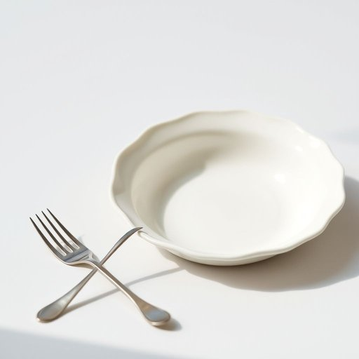

# cake-fork

<h1 style="font-size: 2.5em; font-weight: 300; letter-spacing: 2px; margin: 0; color: #2c3e50;">
/cake-fork*/
</h1>

---

---

## 例句

Whenever we have guests over for afternoon tea, I make sure to lay out the fine china alongside the delicate cake-fork, which, despite its small size, is essential for neatly enjoying those rich, creamy slices of Victoria sponge or lemon drizzle cake without making a mess.

*Whenever(/wɛˈnɛvər/) we(/wi/) have(/hæv/) guests(/gɛsts/) over(/ˈoʊvər/) for(/fər/) afternoon(/ˌæftərˈnun/) tea,(/ti,/) I(/aɪ/) make(/meɪk/) sure(/ʃʊr/) to(/tɪ/) lay(/leɪ/) out(/aʊt/) the(/ðə/) fine(/faɪn/) china(/ˈʧaɪnə/) alongside(/əˈlɔŋˈsaɪd/) the(/ðə/) delicate(/ˈdɛləkət/) cake-fork,(/cake-fork*,/) which,(/wɪʧ,/) despite(/dɪˈspaɪt/) its(/ɪts/) small(/smɔl/) size,(/saɪz,/) is(/ɪz/) essential(/ɛˈsɛnʃəl/) for(/fər/) neatly(/ˈnitli/) enjoying(/ˌɛnˈʤɔɪɪŋ/) those(/ðoʊz/) rich,(/rɪʧ,/) creamy(/ˈkrimi/) slices(/sˈlaɪsɪz/) of(/əv/) Victoria(/vɪkˈtɔriə/) sponge(/spənʤ/) or(/ər/) lemon(/ˈlɛmən/) drizzle(/ˈdrɪzəl/) cake(/keɪk/) without(/wɪˈθaʊt/) making(/ˈmeɪkɪŋ/) a(/ə/) mess.(/mɛs./)*

**翻译：** 每当下午茶有客人来访时，我都会摆放精致的瓷器和细巧的蛋糕叉，尽管蛋糕叉体积小巧，却是优雅享用那丰富香浓的维多利亚海绵蛋糕或柠檬淋酱蛋糕的必备工具，能让人不弄乱食物，尽享美味。

---

## 解释

英语单词cake-fork作为名词在家居生活用品的语境中指的是一种专门用于吃蛋糕的小叉子，通常体积较小，叉齿细短且有时带有三齿设计，方便切割和取食蛋糕。具体使用场合多见于下午茶、宴会或家中餐桌上享用甜点时，用以既优雅又便利地食用蛋糕或类似甜点。英语学习者在使用cake-fork时应注意，该词多为复合名词，需连字符连接，且作为可数名词使用时可构成复数cake-forks；此外，搭配中常见的表达包括use a cake-fork，pass the cake-fork，a silver cake-fork等，表达时通常与餐具和甜品相关的词汇连用。词源方面，cake意指蛋糕，fork指叉子，二者合成表示专用的吃蛋糕器具，起源于西方茶文化中对餐具细分的需求，体现了礼仪和用餐细节的讲究。在中文语境中，cake-fork准确翻译为蛋糕叉或小蛋糕叉，强调其专用性和体积小巧，与普通餐叉区分开来。该词无特殊褒贬含义，文化上体现了西方细致的用餐礼仪和对甜点享受的讲究，是一种实用且带有一定礼仪色彩的生活用品术语。

---

<small style="color: #999; font-size: 0.9em;">2025-07-17 06:22:39</small>

