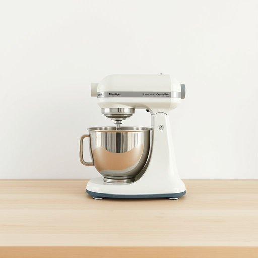

# cake-mixer

<h1 style="font-size: 2.5em; font-weight: 300; letter-spacing: 2px; margin: 0; color: #2c3e50;">
/cake-mixer*/
</h1>

---

---

## 例句

The complexity of the cake-mixer's mechanism, combined with its vintage charm, makes it not only a functional appliance but also a nostalgic centerpiece during family gatherings, enhancing both the baking experience and the overall atmosphere.

*The(/ðə/) complexity(/kəmˈplɛksɪti/) of(/əv/) the(/ðə/) cake-mixer's(/cake-mixer's*/) mechanism,(/ˈmɛkəˌnɪzəm,/) combined(/kəmˈbaɪnd/) with(/wɪθ/) its(/ɪts/) vintage(/ˈvɪntɪʤ/) charm,(/ʧɑrm,/) makes(/meɪks/) it(/ɪt/) not(/nɑt/) only(/ˈoʊnli/) a(/ə/) functional(/ˈfəŋkʃənəl/) appliance(/əˈplaɪəns/) but(/bət/) also(/ˈɔlsoʊ/) a(/ə/) nostalgic(/nɔˈstælʤɪk/) centerpiece(/ˈsɛntərˌpis/) during(/ˈdʊrɪŋ/) family(/ˈfæməli/) gatherings,(/ˈgæðərɪŋz,/) enhancing(/ɛnˈhænsɪŋ/) both(/boʊθ/) the(/ðə/) baking(/ˈbeɪkɪŋ/) experience(/ɪkˈspɪriəns/) and(/ənd/) the(/ðə/) overall(/ˈoʊvərˌɔl/) atmosphere.(/ˈætməsˌfɪr./)*

**翻译：** 蛋糕搅拌机机制的复杂性与其复古魅力相结合，使其不仅是一件实用的家电，更成为家庭聚会中的一件怀旧焦点，既提升了烘焙的体验，也营造了整体的温馨氛围。

---

## 解释

“cake-mixer”作为名词，主要指用于混合蛋糕面糊的电动搅拌器或手持搅拌工具，常见于家庭厨房中制作蛋糕或其他烘焙食品时使用，具体使用场合通常是在烘焙时，需要将面粉、鸡蛋、糖等原料均匀混合并打发蓬松以确保烘焙效果。英语学习者在使用该词时需注意，作为复合名词，采用复数形式时通常在“mixer”后加复数标记，即“cake-mixers”，且该词可用作可数名词，前面可搭配冠词如“a cake-mixer”或所有格结构如“my cake-mixer”，常见的搭配包括“electric cake-mixer”（电动蛋糕搅拌器）、“handheld cake-mixer”（手持蛋糕搅拌器）等。在表达技巧上，可以结合动词“use”、“buy”、“need”等，如“use a cake-mixer to prepare batter”（使用蛋糕搅拌器准备面糊）。词源方面，“cake-mixer”由“cake”（蛋糕）和“mixer”（搅拌器）组合而成，属于典型的复合名词，表示专门用于蛋糕混合的工具，这种构词方式在英语中较为常见。中文语境中通常准确翻译为“蛋糕搅拌器”或“蛋糕打蛋器”，强调其专用于蛋糕材料的混合功能。该词本身无明显褒贬色彩，也无特殊文化内涵，属于中性、实用词汇，主要体现了现代家居生活中厨房电器的细分与专业化，在教学和使用中应注重其具体功能特性以及正确的复合名词构造方式。

---

<small style="color: #999; font-size: 0.9em;">2025-07-17 06:22:39</small>

