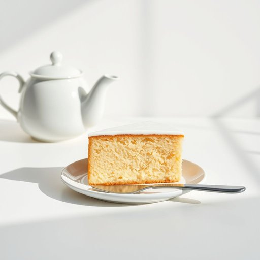

# cake-slice

<h1 style="font-size: 2.5em; font-weight: 300; letter-spacing: 2px; margin: 0; color: #2c3e50;">
/cake-slice*/
</h1>

---

---

## 例句

Could you please pass me the cake-slice that’s lying next to the teapot on the kitchen counter, the one with the slightly bent handle which always makes cutting the sponge cake so much easier during our family gatherings?

*Could(/kʊd/) you(/ju/) please(/pliz/) pass(/pæs/) me(/mi/) the(/ðə/) cake-slice(/cake-slice*/) that’s(/that’s*/) lying(/laɪɪŋ/) next(/nɛkst/) to(/tɪ/) the(/ðə/) teapot(/ˈtiˌpɑt/) on(/ɔn/) the(/ðə/) kitchen(/ˈkɪʧən/) counter,(/ˈkaʊntər,/) the(/ðə/) one(/wən/) with(/wɪθ/) the(/ðə/) slightly(/sˈlaɪtli/) bent(/bɛnt/) handle(/ˈhændəl/) which(/wɪʧ/) always(/ˈɔlˌweɪz/) makes(/meɪks/) cutting(/ˈkətɪŋ/) the(/ðə/) sponge(/spənʤ/) cake(/keɪk/) so(/soʊ/) much(/məʧ/) easier(/ˈiziər/) during(/ˈdʊrɪŋ/) our(/ɑr/) family(/ˈfæməli/) gatherings?(/ˈgæðərɪŋz?/)*

**翻译：** 请帮我递一下厨房台面上紧挨茶壶放着的那把蛋糕刀，就是那把手柄微微弯曲的，在我们家庭聚会时总能让切海绵蛋糕变得更加轻松的那把。

---

## 解释

cake-slice作为名词主要指用于切蛋糕的工具，即蛋糕刀或蛋糕切片器，通常是一种带有宽扁形刀片和柄的厨具，能够平稳地切取蛋糕的单块。它常出现在家庭聚会、茶点时间或生日庆典等需要分蛋糕的场合。英语学习者使用该词时需注意它是一个复合名词，通常以连字符连接，整体作单数或复数使用（cake-slice/cake-slices）；该词前可加冠词，如a cake-slice或the cake-slice，且在描述用途时常与动词cut、serve连用，如use a cake-slice to cut the cake。另外，cake slice也可不加连字符，但加连字符更为准确和常见。该词起源于cake（蛋糕）与slice（切片）的组合，体现了工具的功能属性，即切蛋糕的切片工具。中文语境中，cake-slice准确译为蛋糕刀或蛋糕切片器，强调其在家居生活用品中的实用性，通常无褒贬色彩，也没有特殊的文化内涵，只是厨房用具的通用名称。

---

<small style="color: #999; font-size: 0.9em;">2025-07-17 06:22:39</small>

