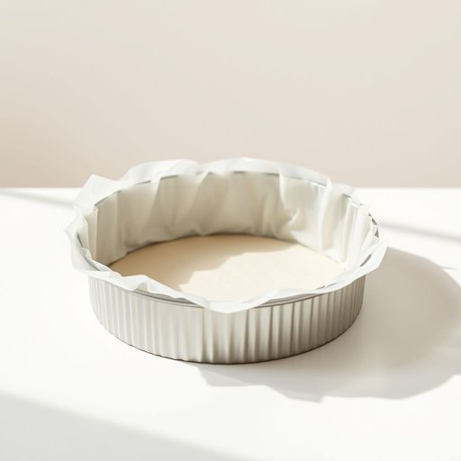

# cake-tin

<h1 style="font-size: 2.5em; font-weight: 300; letter-spacing: 2px; margin: 0; color: #2c3e50;">
/cake-tin*/
</h1>

---

---

## 例句

Before you start mixing the ingredients, could you please fetch the large round cake-tin from the top cupboard, the one lined with non-stick paper we bought last summer, as it’s ideal for baking the Victoria sponge we planned for the family gathering this weekend?

*Before(/ˌbiˈfɔr/) you(/ju/) start(/stɑrt/) mixing(/ˈmɪksɪŋ/) the(/ðə/) ingredients,(/ˌɪnˈgridiənts,/) could(/kʊd/) you(/ju/) please(/pliz/) fetch(/fɛʧ/) the(/ðə/) large(/lɑrʤ/) round(/raʊnd/) cake-tin(/cake-tin*/) from(/frəm/) the(/ðə/) top(/tɔp/) cupboard,(/ˈkəbərd,/) the(/ðə/) one(/wən/) lined(/laɪnd/) with(/wɪθ/) non-stick(/nɑnˈstɪk/) paper(/ˈpeɪpər/) we(/wi/) bought(/bɔt/) last(/læst/) summer,(/ˈsəmər,/) as(/ɛz/) it’s(/it’s*/) ideal(/aɪˈdil/) for(/fər/) baking(/ˈbeɪkɪŋ/) the(/ðə/) Victoria(/vɪkˈtɔriə/) sponge(/spənʤ/) we(/wi/) planned(/plænd/) for(/fər/) the(/ðə/) family(/ˈfæməli/) gathering(/ˈgæðərɪŋ/) this(/ðɪs/) weekend?(/ˈwiˌkɪnd?/)*

**翻译：** 在开始混合配料之前，能否请你帮我从顶层橱柜里取出那个大圆形蛋糕模具？就是我们去年夏天买的那个，里边铺了不粘纸，非常适合用来烤这个周末家庭聚会准备的维多利亚海绵蛋糕。

---

## 解释

英语单词cake-tin作为名词，指的是一种用于烘焙蛋糕的容器，通常为圆形或方形的金属模具，常见于家庭厨房和烘焙场合。在家居生活用品的语境中，cake-tin主要用来盛放蛋糕糊，便于蛋糕在烤箱中定型和烘烤，使用者多为烘焙爱好者或专业厨师。英语学习者在使用cake-tin时需注意，它通常作为可数名词出现，单数形式为cake-tin，复数形式为cake-tins；此外，与该词常见搭配有动词短语，如“buy a cake-tin”表示购买蛋糕模具，或“grease the cake-tin”即在蛋糕模具内涂油防粘。表达技巧上，可结合形容词说明大小和形状，如“a large round cake-tin”（一个大圆形蛋糕模具）或用介词短语描述用途，如“a cake-tin for chocolate cakes”（用于巧克力蛋糕的蛋糕模具）。该词源自英语单词cake(蛋糕)和tin(锡盒、金属容器)的组合，因蛋糕模具多为锡制或其他金属材质而得名，属于复合词，体现了功能性命名的特点。在中文语境中，cake-tin准确翻译为“蛋糕模具”或“烤蛋糕模”，涵盖了其作为烘焙用品的具体用途和形态，应避免直译为“蛋糕锡罐”等可能引起误解的表达。此词本身无褒贬色彩，属于中性词汇，主要体现家庭烘焙文化中常用厨房用具的专业称谓。

---

<small style="color: #999; font-size: 0.9em;">2025-07-17 06:22:39</small>

