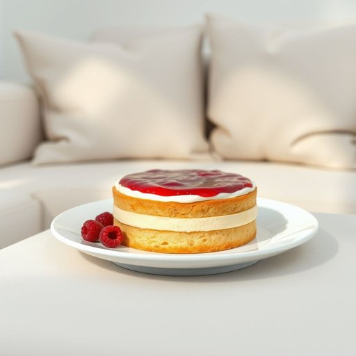

# cake

<h1 style="font-size: 2.5em; font-weight: 300; letter-spacing: 2px; margin: 0; color: #2c3e50;">
/keɪk/
</h1>

---

---

## 例句

After tidying up the living room and arranging the cushions neatly, she placed the homemade Victoria sponge cake, which was frosted with fresh cream and raspberry jam, carefully on the elegant porcelain plate, hoping it would impress her guests during the afternoon tea.

*After(/ˈæftər/) tidying(/tidying*/) up(/əp/) the(/ðə/) living(/ˈlɪvɪŋ/) room(/rum/) and(/ənd/) arranging(/ərˈeɪnʤɪŋ/) the(/ðə/) cushions(/ˈkʊʃənz/) neatly,(/ˈnitli,/) she(/ʃi/) placed(/pleɪst/) the(/ðə/) homemade(/ˈhoʊˈmeɪd/) Victoria(/vɪkˈtɔriə/) sponge(/spənʤ/) cake,(/keɪk,/) which(/wɪʧ/) was(/wɑz/) frosted(/ˈfrɔstɪd/) with(/wɪθ/) fresh(/frɛʃ/) cream(/krim/) and(/ənd/) raspberry(/ˈræzˌbɛri/) jam,(/ʤæm,/) carefully(/ˈkɛrfəli/) on(/ɔn/) the(/ðə/) elegant(/ˈɛləgənt/) porcelain(/ˈpɔrsələn/) plate,(/pleɪt,/) hoping(/ˈhoʊpɪŋ/) it(/ɪt/) would(/wʊd/) impress(/ˌɪmˈprɛs/) her(/hər/) guests(/gɛsts/) during(/ˈdʊrɪŋ/) the(/ðə/) afternoon(/ˌæftərˈnun/) tea.(/ti./)*

**翻译：** 整理好客厅并将靠垫整齐摆放后，她小心翼翼地将自制的维多利亚海绵蛋糕——表面涂抹着鲜奶油和覆盆子果酱——放在精致的瓷盘上，期望下午茶时能给客人们留下深刻的印象。

---

## 解释

英语单词“cake”作为名词在家居生活用品的语境中，主要指一种用面粉、糖、鸡蛋等原料烘焙而成的甜点，常作为家庭日常饮食、庆祝活动或聚会中的食品。具体使用场合多见于厨房、餐厅或家庭聚会中，比如“切一块蛋糕（a piece of cake）”，“生日蛋糕（birthday cake）”等。英语学习者在使用“cake”时应注意其不可数和可数用法：当指蛋糕整体时通常是可数名词，如“a cake”；而指蛋糕类食物时可泛指且常与量词连用，如“some cake”。此外，“cake”常与形容词搭配，如“chocolate cake”“fruit cake”，以及固定短语“cake pan”（蛋糕模具）等。在语法上，“cake”作为名词后可跟复数形式“cakes”表示多块蛋糕。词源方面，“cake”源自古英语“cace”，源自拉丁语“placenta”，意为扁平的烘焙食品，反映了蛋糕制作的历史演变。中文环境下，“cake”准确翻译为“蛋糕”，是一个普遍且中性词汇，主要指甜食产品，无特别褒贬或隐喻含义，但在英语口语中，“piece of cake”作为习惯用语具备“非常容易”的隐喻意义。在家庭生活用品的语境中，理解“cake”的基础意义并掌握其常见搭配有助于正确表达和理解相关饮食文化。

---

<small style="color: #999; font-size: 0.9em;">2025-07-17 06:22:39</small>

