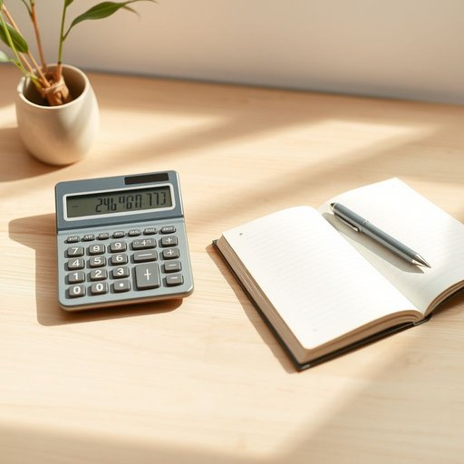

# calculator

<h1 style="font-size: 2.5em; font-weight: 300; letter-spacing: 2px; margin: 0; color: #2c3e50;">
/ˈkælkjəˌleɪtər/
</h1>

---

---

## 例句

Before settling down to balance the household budget, I always make sure the calculator, which sits neatly on the kitchen counter alongside the notepad and pen we use for jotting down expenses, is fully functional and loaded with fresh batteries.

*Before(/ˌbiˈfɔr/) settling(/ˈsɛtəlɪŋ/) down(/daʊn/) to(/tɪ/) balance(/ˈbæləns/) the(/ðə/) household(/ˈhaʊsˌhoʊld/) budget,(/ˈbəʤɪt,/) I(/aɪ/) always(/ˈɔlˌweɪz/) make(/meɪk/) sure(/ʃʊr/) the(/ðə/) calculator,(/ˈkælkjəˌleɪtər,/) which(/wɪʧ/) sits(/sɪts/) neatly(/ˈnitli/) on(/ɔn/) the(/ðə/) kitchen(/ˈkɪʧən/) counter(/ˈkaʊntər/) alongside(/əˈlɔŋˈsaɪd/) the(/ðə/) notepad(/notepad*/) and(/ənd/) pen(/pɛn/) we(/wi/) use(/juz/) for(/fər/) jotting(/jotting*/) down(/daʊn/) expenses,(/ɪkˈspɛnsɪz,/) is(/ɪz/) fully(/ˈfʊli/) functional(/ˈfəŋkʃənəl/) and(/ənd/) loaded(/ˈloʊdɪd/) with(/wɪθ/) fresh(/frɛʃ/) batteries.(/ˈbætəriz./)*

**翻译：** 在开始安排家庭预算之前，我总会确认厨房台面上那台与我们用来记账的笔记本和钢笔整齐摆放在一起的计算器，功能完好且电池充足。

---

## 解释

单词“calculator”作为名词，在家居生活用品的语境中通常指一种小型便携电子设备，用于进行基本的数学计算，如加减乘除，广泛应用于家庭账单核算、预算规划或孩子做作业时辅助运算。使用时应注意，该词为可数名词，复数形式为“calculators”，常见搭配有“electronic calculator”（电子计算器）、“pocket calculator”（便携计算器）和“scientific calculator”（科学计算器），这些表达帮助区分其功能和类型。语法上，作为名词，“calculator”可作主语、宾语或表语，例如“The calculator is on the desk.”（计算器在桌子上）或“I bought a new calculator for home use.”（我买了一个新计算器用于家中使用）。词源上，“calculator”来源于拉丁语“calculare”，意为“用小石子计算”，反映了人类早期使用石子辅助计算的历史演变，逐渐演变为现代电子计算器。中文语境中，准确翻译为“计算器”，明确指代用于数字计算的工具，通常不含贬义色彩，属于中性词汇，且在生活中广受欢迎和接受，没有特殊的文化内涵或褒义贬义倾向，仅表示一种实用工具。

---

<small style="color: #999; font-size: 0.9em;">2025-07-17 06:22:39</small>

