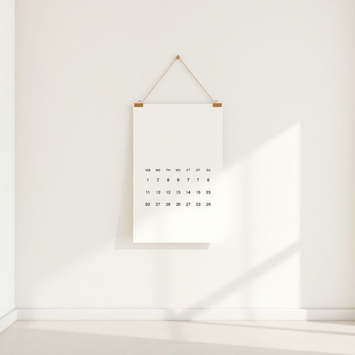

# calendar

<h1 style="font-size: 2.5em; font-weight: 300; letter-spacing: 2px; margin: 0; color: #2c3e50;">
/ˈkæləndər/
</h1>

---

---

## 例句

Could you please check the calendar hanging by the kitchen door to see if the calendar has any appointments or events scheduled for next week, especially since the calendar is essential for coordinating the delivery of the new furniture with the plumber’s visit on Wednesday?

*Could(/kʊd/) you(/ju/) please(/pliz/) check(/ʧɛk/) the(/ðə/) calendar(/ˈkæləndər/) hanging(/ˈhæŋɪŋ/) by(/baɪ/) the(/ðə/) kitchen(/ˈkɪʧən/) door(/dɔr/) to(/tɪ/) see(/si/) if(/ɪf/) the(/ðə/) calendar(/ˈkæləndər/) has(/həz/) any(/ˈɛni/) appointments(/əˈpɔɪntmənts/) or(/ər/) events(/ɪˈvɛnts/) scheduled(/ˈskɛʤʊld/) for(/fər/) next(/nɛkst/) week,(/wik,/) especially(/əˈspɛʃəli/) since(/sɪns/) the(/ðə/) calendar(/ˈkæləndər/) is(/ɪz/) essential(/ɛˈsɛnʃəl/) for(/fər/) coordinating(/koʊˈɔrdəˌneɪtɪŋ/) the(/ðə/) delivery(/dɪˈlɪvəri/) of(/əv/) the(/ðə/) new(/nu/) furniture(/ˈfərnɪʧər/) with(/wɪθ/) the(/ðə/) plumber’s(/plumber’s*/) visit(/ˈvɪzɪt/) on(/ɔn/) Wednesday?(/ˈwɛnzˌdeɪ?/)*

**翻译：** 请您查看挂在厨房门旁的日历，确认日历上是否有下周的约会或活动安排，特别是因为该日历对于协调新家具送货和周三水管工来访的时间非常重要。

---

## 解释

英语单词calendar在家居生活用品场景中作为名词，通常指挂在墙上或摆放在桌面上的日历，用于记录日期、月份，方便安排和查看时间，场合多为家庭、办公室或学习环境。学习者使用时需注意，calendar是可数名词，复数形式为calendars，常见搭配有wall calendar（挂历）、desk calendar（台历）、calendar page（日历页）等。此外，calendar常与表示时间的词汇搭配，如calendar year（日历年，指公历年份）、calendar month（日历月）等。使用时应避免与schedule混淆，后者偏重具体的时间安排而非整体的日期系统。词源方面，calendar源于拉丁语calendarium，意为账簿、登记簿，由calendae演变而来，其原意是罗马历法中每月的第一天，用于记录债务和重要事项。汉语中通常翻译为日历，其含义准确反映了作为时间工具的功能，没有贬义或褒义色彩，但在文化上日历不仅是实用工具，也承载着节日、纪念日等社会文化信息，因此在家庭中常作为装饰品或纪念品出现，体现一定的生活美学与实用价值。

---

<small style="color: #999; font-size: 0.9em;">2025-07-17 06:22:39</small>

