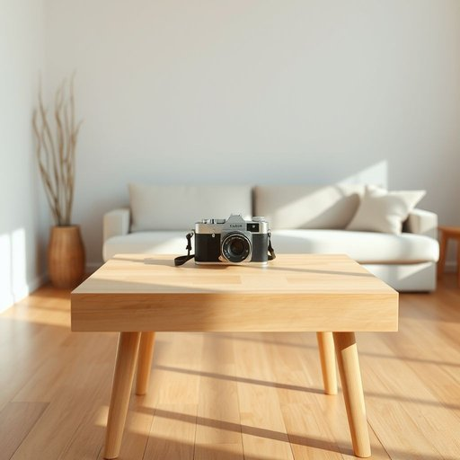

# camera

<h1 style="font-size: 2.5em; font-weight: 300; letter-spacing: 2px; margin: 0; color: #2c3e50;">
/ˈkæmərə/
</h1>

---

---

## 例句

While tidying up the living room, the discovery of a camera triggered a nostalgic surge, as that camera, an invaluable noun, encapsulated decades of cherished family gatherings and artistic experimentation even under challenging lighting conditions.

*While(/waɪl/) tidying(/tidying*/) up(/əp/) the(/ðə/) living(/ˈlɪvɪŋ/) room,(/rum,/) the(/ðə/) discovery(/ˌdɪˈskəvri/) of(/əv/) a(/ə/) camera(/ˈkæmərə/) triggered(/ˈtrɪgərd/) a(/ə/) nostalgic(/nɔˈstælʤɪk/) surge,(/sərʤ,/) as(/ɛz/) that(/ðət/) camera,(/ˈkæmərə,/) an(/ən/) invaluable(/ˌɪnˈvæljəbəl/) noun,(/naʊn,/) encapsulated(/ɛnˈkæpsəˌleɪtɪd/) decades(/ˈdɛkeɪdz/) of(/əv/) cherished(/ˈʧɛrɪʃt/) family(/ˈfæməli/) gatherings(/ˈgæðərɪŋz/) and(/ənd/) artistic(/ɑrˈtɪstɪk/) experimentation(/ɪkˌspɛrəmənˈteɪʃən/) even(/ˈivɪn/) under(/ˈəndər/) challenging(/ˈʧælənʤɪŋ/) lighting(/ˈlaɪtɪŋ/) conditions.(/kənˈdɪʃənz./)*

**翻译：** 在整理客厅时，发现了一台相机，瞬间激起了浓浓的怀旧情怀。那台相机，这件无价之物，凝聚了数十年来珍贵的家庭聚会回忆和艺术创作的点滴，即使在光线条件严苛的环境下亦不例外。

---

## 解释

英语单词"camera"作为名词在家居生活用品的语境中，通常指用于拍照或录像的设备，如数码相机、监控摄像头或智能家居中的摄像装置，常见于描述家庭记录生活、拍摄照片或家庭安全监控的场合。英语学习者在使用"camera"时应注意其基本语法为可数名词，复数形式为"cameras"，常见搭配有"take a camera"（携带相机）、"use a camera"（使用相机）、"security camera"（监控摄像头）等，表达时需区分其用途和类型，避免混淆，例如普通照相机与监控摄像头的不同。该词源自拉丁语“camera”，意为“房间”或“密室”，后通过法语进入英语，最初指具有暗箱结构的成像设备。“camera”在中文语境中通常被准确翻译为“相机”或“摄像头”，具体含义依据上下文调整，如“家用摄像头”强调设备用于家庭安全监控，而“数码相机”强调拍摄功能，词汇本身无特别褒贬或文化色彩，但在家庭环境中常带有记录美好生活和保障安全的积极内涵。

---

<small style="color: #999; font-size: 0.9em;">2025-07-17 06:22:39</small>

