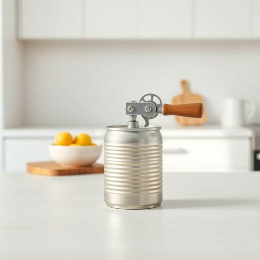

# can-opener

<h1 style="font-size: 2.5em; font-weight: 300; letter-spacing: 2px; margin: 0; color: #2c3e50;">
/can-opener*/
</h1>

---

---

## 例句

The can-opener, essential for accessing the tin of tomatoes, was misplaced in the drawer beside the sink, making it crucial to locate before beginning to prepare the sauce to ensure the meal could be cooked properly tonight.

*The(/ðə/) can-opener,(/can-opener*,/) essential(/ɛˈsɛnʃəl/) for(/fər/) accessing(/ˈækˌsɛsɪŋ/) the(/ðə/) tin(/tɪn/) of(/əv/) tomatoes,(/təˈmɑtoʊz,/) was(/wɑz/) misplaced(/mɪˈspleɪst/) in(/ɪn/) the(/ðə/) drawer(/drɔr/) beside(/ˌbiˈsaɪd/) the(/ðə/) sink,(/sɪŋk,/) making(/ˈmeɪkɪŋ/) it(/ɪt/) crucial(/ˈkruʃəl/) to(/tɪ/) locate(/ˈloʊˌkeɪt/) before(/ˌbiˈfɔr/) beginning(/bɪˈgɪnɪŋ/) to(/tɪ/) prepare(/priˈpɛr/) the(/ðə/) sauce(/sɔs/) to(/tɪ/) ensure(/ɪnˈʃʊr/) the(/ðə/) meal(/mil/) could(/kʊd/) be(/bi/) cooked(/kʊkt/) properly(/ˈprɑpərli/) tonight.(/təˈnaɪt./)*

**翻译：** 打开罐头的工具对于开启番茄罐头至关重要，但它错放在洗碗槽旁的抽屉里，因此在开始准备酱料之前，必须先找到它，以确保今晚的饭菜能够顺利烹制。

---

## 解释

单词“can-opener”作为名词，指的是用于开启金属罐头的工具，即“开罐器”或“开罐刀”，主要出现在家居生活用品的语境中，常用于厨房中开启罐头食品时。具体使用场合一般是在烹饪准备过程中，需要打开罐装食物或饮料时，强调实用功能。在英语学习中，使用该词时需注意其复合结构，通常将“can”与“opener”通过连字符连接，表明这是一个复合名词，且单数时不加复数形式的-s，如多把开罐器应为“can-openers”。此外，该词的常见搭配有“manual can-opener”（手动开罐器）、“electric can-opener”（电动开罐器）、“use a can-opener”（用开罐器），表达时应关注这些固定搭配。该词来源于19世纪末至20世纪初随罐头食品普及而发展的工具名称，其中“can”指罐头，“opener”指开具工具，合成词形象且直观。中文理解上，“can-opener”准确译为“开罐器”，这是厨房常见的工具，无特殊褒贬意味，属于中性词，承载的是实用性含义，没有隐含文化色彩或特殊语境色彩。英语学习者应避免将“can-opener”误用为动词或形容词，因其严格是名词，且多在实体工具指代上使用，而非形容罐头本身或其他含义。

---

<small style="color: #999; font-size: 0.9em;">2025-07-17 06:22:39</small>

