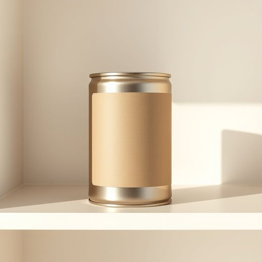

# can

<h1 style="font-size: 2.5em; font-weight: 300; letter-spacing: 2px; margin: 0; color: #2c3e50;">
/kən/
</h1>

---

---

## 例句

Could you please pass me the can of baked beans from the cupboard, the one with the slightly dented label, because I want to prepare a quick lunch before the guests arrive this afternoon?

*Could(/kʊd/) you(/ju/) please(/pliz/) pass(/pæs/) me(/mi/) the(/ðə/) can(/kən/) of(/əv/) baked(/beɪkt/) beans(/binz/) from(/frəm/) the(/ðə/) cupboard,(/ˈkəbərd,/) the(/ðə/) one(/wən/) with(/wɪθ/) the(/ðə/) slightly(/sˈlaɪtli/) dented(/ˈdɛntɪd/) label,(/ˈleɪbəl,/) because(/bɪˈkəz/) I(/aɪ/) want(/wɔnt/) to(/tɪ/) prepare(/priˈpɛr/) a(/ə/) quick(/kwɪk/) lunch(/lənʧ/) before(/ˌbiˈfɔr/) the(/ðə/) guests(/gɛsts/) arrive(/əraɪv/) this(/ðɪs/) afternoon?(/ˌæftərˈnun?/)*

**翻译：** 请你帮我从橱柜里拿一下那罐标签略微凹陷的烤豆罐头吗？我想在客人下午到来之前准备一顿简单的午餐。

---

## 解释

在家居生活用品的语境中，英语单词“can”作为名词主要指罐头盒、金属罐或容器，通常用于盛装食品或饮料，如a can of soda（一罐汽水）或a can of beans（一罐豆子），具体使用场合多出现在购物、厨房储存、饮食准备及垃圾分类等生活场景中，需要注意的是，作为名词时，can通常是可数名词，复数形式为cans，例如two cans of soup（两罐汤），且前面常搭配数量词或介词短语表明内容，如a can of加食物、饮料等，此外，can在表示容器时，一般特指金属或类似材质的易拉罐或密封罐，区别于glass jar（玻璃罐）或bottle（瓶子），词源方面，can源自中古英语，可能源自古英语canna，意指用于盛装液体的罐子或壶，反映了该词作为容器的传统使用，中文语境中，can准确翻译为罐、罐头或罐子，需根据具体物品和内容区分，如食品罐头多译为罐头，饮料容器可称罐，该词无明显褒贬含义，但在文化上罐装食品与新鲜食品存在对比，可能带有便利与加工食品的隐含意味，英语学习者应注意区分can作为情态动词（表示能力、许可）和名词的用法，避免混淆，同时掌握其固定搭配以及可数名词的复数形式，提升表达准确性。

---

<small style="color: #999; font-size: 0.9em;">2025-07-17 06:22:39</small>

