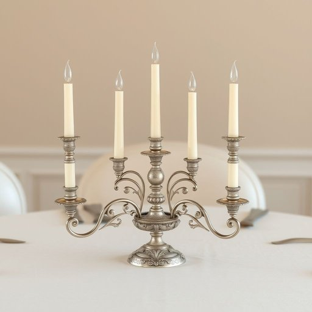

# candelabra

<h1 style="font-size: 2.5em; font-weight: 300; letter-spacing: 2px; margin: 0; color: #2c3e50;">
/ˌkændəˈlɑbrə/
</h1>

---

---

## 例句

I decided to place the antique silver candelabra, which I inherited from my grandmother and meticulously polished last weekend, at the centre of the dining table, where its intricate design and multiple arms holding slender, ivory candles create a warm and elegant atmosphere during our family dinners.

*I(/aɪ/) decided(/ˌdɪˈsaɪdɪd/) to(/tɪ/) place(/pleɪs/) the(/ðə/) antique(/ænˈtik/) silver(/ˈsɪlvər/) candelabra,(/ˌkændəˈlɑbrə,/) which(/wɪʧ/) I(/aɪ/) inherited(/ˌɪnˈhɛrətɪd/) from(/frəm/) my(/maɪ/) grandmother(/ˈgrændˌməðər/) and(/ənd/) meticulously(/məˈtɪkjələsli/) polished(/ˈpɑlɪʃt/) last(/læst/) weekend,(/ˈwiˌkɪnd,/) at(/æt/) the(/ðə/) centre(/ˈsɛntər/) of(/əv/) the(/ðə/) dining(/ˈdaɪnɪŋ/) table,(/ˈteɪbəl,/) where(/wɛr/) its(/ɪts/) intricate(/ˈɪntrəkət/) design(/dɪˈzaɪn/) and(/ənd/) multiple(/ˈməltəpəl/) arms(/ɑrmz/) holding(/ˈhoʊldɪŋ/) slender,(/sˈlɛndər,/) ivory(/ˈaɪvəri/) candles(/ˈkændəlz/) create(/kriˈeɪt/) a(/ə/) warm(/wɔrm/) and(/ənd/) elegant(/ˈɛləgənt/) atmosphere(/ˈætməsˌfɪr/) during(/ˈdʊrɪŋ/) our(/ɑr/) family(/ˈfæməli/) dinners.(/ˈdɪnərz./)*

**翻译：** 我决定将那盏祖母遗留下来、我上周细心擦拭过的古董银制烛台摆放在餐桌中央，其复杂的设计以及多臂上托着纤细象牙色蜡烛，在我们家庭晚宴时营造出温馨雅致的氛围。

---

## 解释

英语单词“candelabra”在家居生活用品的语境中作为名词，指的是多臂或多枝的烛台，通常用于装饰性照明，常见于客厅、餐厅或宴会场合，特别适合营造古典、豪华或庄重的氛围。英语学习者在使用该词时应注意其复数形式“candelabra”本身即为复数，单数形式较少使用且为“candelabrum”，通常在口语和日常写作中直接用“candelabra”表示单数和复数均可。此外，“candelabra”常与形容词如“ornate”（华丽的）、“antique”（古董的）搭配，或与介词短语如“on the dining table”（放在餐桌上）共同使用。该词源于拉丁语“candelabrum”，意为“烛台”，由“candela”（蜡烛）演变而来，体现了其历史上作为点燃蜡烛的实用和装饰性物品的传统。在中文语境中，“candelabra”应准确翻译为“多臂烛台”或“多枝烛台”，强调其结构特征，区别于单枝“烛台”或“烛台灯”，在文化内涵上通常带有复古、高雅的象征，使用时多用于形容贵族或传统风格的家居陈设，无特别褒贬色彩，但在现代简约家居中使用较少，显得较为正式和古典。

---

<small style="color: #999; font-size: 0.9em;">2025-07-17 06:22:39</small>

