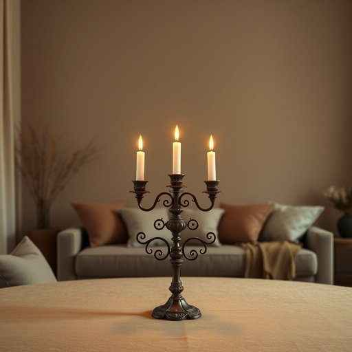

# candleholder

<h1 style="font-size: 2.5em; font-weight: 300; letter-spacing: 2px; margin: 0; color: #2c3e50;">
/candleholder*/
</h1>

---

---

## 例句

The intricate candleholder, a treasured family heirloom passed down through generations, stood proudly in the center of the room, its elegant design casting dancing shadows that enhanced the intimate ambiance of the evening gathering.

*The(/ðə/) intricate(/ˈɪntrəkət/) candleholder,(/candleholder*,/) a(/ə/) treasured(/ˈtrɛʒərd/) family(/ˈfæməli/) heirloom(/ˈɛˌrlum/) passed(/pæst/) down(/daʊn/) through(/θru/) generations,(/ˌʤɛnərˈeɪʃənz,/) stood(/stʊd/) proudly(/ˈpraʊdli/) in(/ɪn/) the(/ðə/) center(/ˈsɛnər/) of(/əv/) the(/ðə/) room,(/rum,/) its(/ɪts/) elegant(/ˈɛləgənt/) design(/dɪˈzaɪn/) casting(/ˈkæstɪŋ/) dancing(/ˈdænsɪŋ/) shadows(/ˈʃæˌdoʊz/) that(/ðət/) enhanced(/ɛnˈhænst/) the(/ðə/) intimate(/ˈɪnɪmət/) ambiance(/ˈæmbiəns/) of(/əv/) the(/ðə/) evening(/ˈivnɪŋ/) gathering.(/ˈgæðərɪŋ./)*

**翻译：** 这座精致的烛台是家族代代相传的珍贵传家宝，骄傉地矗立在房间中央，其优雅的设计投下摇曳的光影，增添了晚间聚会的温馨氛围。

---

## 解释

“candleholder”作为名词，指的是用来固定或支撑蜡烛的器具，常见于家居生活用品中，例如餐桌、客厅或卧室等地方用来点蜡烛增添氛围、照明或装饰。在具体使用场合上，candleholder通常出现在描述家庭布置、节日装饰或传统仪式的语境中。英语学习者在使用该词时需要注意其复合词结构，通常是由“candle”（蜡烛）和“holder”（承载物）组成，属于可数名词，复数形式为“candleholders”。常见搭配包括“a brass candleholder”（铜制烛台）、“a decorative candleholder”（装饰性烛台）以及“wooden candleholder”（木制烛台）。此外，表达时要注意其作为具体可触物品的物理属性，常用定冠词the或不定冠词a/an修饰。词源上，“candleholder”源自古英语“candel”意为蜡烛，加上“holder”即持有者或支架的意思，整体体现了功能性的描述。这个词在中文语境中准确翻译为“烛台”或“烛座”，强调其承载和固定蜡烛的作用，没有褒贬色彩，属于中性词汇，文化内涵主要体现在西方传统点蜡烛习惯以及居家温馨氛围的营造。总的来说，candleholder是一个实用且常见的家居生活词汇，体现了物品的功能性与装饰性双重属性。

---

<small style="color: #999; font-size: 0.9em;">2025-07-17 06:22:39</small>

