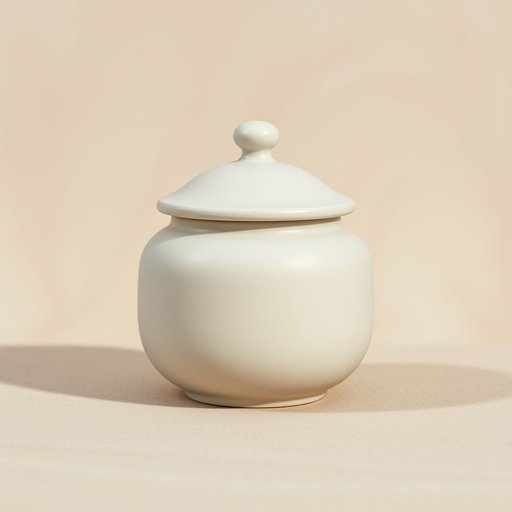

# canister

<h1 style="font-size: 2.5em; font-weight: 300; letter-spacing: 2px; margin: 0; color: #2c3e50;">
/ˈkænɪstər/
</h1>

---

---

## 例句

When we went to the vintage bookstore, I asked the owner if he could recommend an airtight canister to store my rare postcards, especially one that wouldn’t let humidity or dust ruin their condition over time, since preserving their value is really important to me.

*When(/wɪn/) we(/wi/) went(/wɛnt/) to(/tɪ/) the(/ðə/) vintage(/ˈvɪntɪʤ/) bookstore,(/ˈbʊkˌstɔr,/) I(/aɪ/) asked(/æst/) the(/ðə/) owner(/ˈoʊnər/) if(/ɪf/) he(/hi/) could(/kʊd/) recommend(/ˌrɛkəˈmɛnd/) an(/ən/) airtight(/ˈɛrˌtaɪt/) canister(/ˈkænɪstər/) to(/tɪ/) store(/stɔr/) my(/maɪ/) rare(/rɛr/) postcards,(/ˈpoʊˌskɑrdz,/) especially(/əˈspɛʃəli/) one(/wən/) that(/ðət/) wouldn’t(/wouldn’t*/) let(/lɛt/) humidity(/hjuˈmɪdəti/) or(/ər/) dust(/dəst/) ruin(/ruɪn/) their(/ðɛr/) condition(/kənˈdɪʃən/) over(/ˈoʊvər/) time,(/taɪm,/) since(/sɪns/) preserving(/prɪˈzərvɪŋ/) their(/ðɛr/) value(/ˈvælju/) is(/ɪz/) really(/ˈrɪli/) important(/ˌɪmˈpɔrtənt/) to(/tɪ/) me.(/mi./)*

**翻译：** 当我们去那家古董书店时，我问店主是否能推荐一个密封罐用来存放我珍贵的明信片，特别是那种能够防潮防尘、避免长期损害明信片状态的，因为保持它们的价值对我来说非常重要。

---

## 解释

单词“canister”在家居生活用品的语境中作为名词，通常指一种有盖的小容器，用于储存茶叶、咖啡粉、糖、饼干等干燥食品或散装物品，常见于厨房或餐厅环境，方便保存和使用。学习者在使用“canister”时需注意它是可数名词，常与量词连用，如“一罐咖啡”（a canister of coffee），且常见搭配有“罐盖”（canister lid）、“真空罐”（vacuum canister）等，表达时多用于具体指代某种储物罐，较少出现在抽象用法中。词源上，“canister”源自中古法语“canistre”，最终源自拉丁语中的“canistrum”，意为篮子或小篮筐，体现其原本作为容器的功能。中文中，“canister”通常译为“罐子”“小罐”或“储物罐”，强调其小巧、有盖且用于储藏的特性，没有褒贬或特殊文化色彩，属于中性词汇，常见于日常家居物品描述中，理解时应重点注意其材质（如金属、玻璃或塑料）和用途（存放干货），避免与较大或无盖的容器混淆。

---

<small style="color: #999; font-size: 0.9em;">2025-07-17 06:22:39</small>

