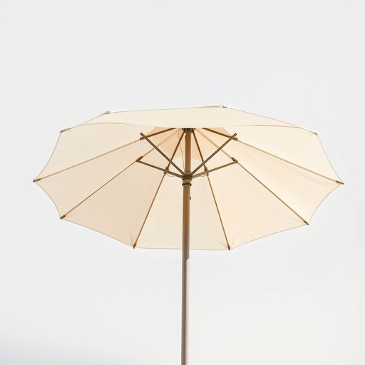

# canopy

<h1 style="font-size: 2.5em; font-weight: 300; letter-spacing: 2px; margin: 0; color: #2c3e50;">
/ˈkænəpi/
</h1>

---

---

## 例句

Could you please help me fix the canopy on the patio umbrella, which has been sagging since last week due to the heavy rain and needs to be properly secured before the garden party this weekend?

*Could(/kʊd/) you(/ju/) please(/pliz/) help(/hɛlp/) me(/mi/) fix(/fɪks/) the(/ðə/) canopy(/ˈkænəpi/) on(/ɔn/) the(/ðə/) patio(/ˈpætiˌoʊ/) umbrella,(/ˈəmˌbrɛlə,/) which(/wɪʧ/) has(/həz/) been(/bɪn/) sagging(/ˈsægɪŋ/) since(/sɪns/) last(/læst/) week(/wik/) due(/du/) to(/tɪ/) the(/ðə/) heavy(/ˈhɛvi/) rain(/reɪn/) and(/ənd/) needs(/nidz/) to(/tɪ/) be(/bi/) properly(/ˈprɑpərli/) secured(/sɪˈkjʊrd/) before(/ˌbiˈfɔr/) the(/ðə/) garden(/ˈgɑrdən/) party(/ˈpɑrti/) this(/ðɪs/) weekend?(/ˈwiˌkɪnd?/)*

**翻译：** 您能帮我修一下露台伞的伞蓬吗？上周因暴雨导致伞蓬下垂，需要在本周末的花园派对前妥善固定。

---

## 解释

单词"canopy"在家居生活用品的语境中作为名词，通常指的是覆盖或遮蔽物，如床帐、遮阳篷或天篷。具体使用场合包括带有装饰性或功能性的布制覆盖物，比如婴儿床上的蚊帐、四柱床上方的纱帐，或者户外休闲区遮挡阳光的遮棚。英语学习者应注意，"canopy"作为名词通常不可数，也可作可数名词表示具体的覆盖物；常见搭配有"canopy bed"（有帐篷式床）、"canopy frame"（帐篷架）、"awning canopy"（遮阳篷）等，表达时可结合具体场景明确指代。语法上，"canopy"多用于描述覆盖结构，前面经常有冠词或限定词，如"a canopy"或"the canopy"；此外，动词形式较少见，通常作为名词使用。词源上，"canopy"来自中古法语"canopee"，进一步源自希腊语"kónōpē"（意思是蚊帐），最初指的是用于防蚊虫的布帐，经过演变延伸到各种覆盖物和遮蔽物。中文语境中准确翻译为“（装饰性或功能性的）遮篷”、“天蓬”或“帐篷式覆盖物”，在家居环境主要理解为床帐或户外遮阳用的顶棚。该词通常中性无褒贬色彩，文化内涵较少，然而在装饰语境中，"canopy bed"常带有一种华丽、浪漫或古典的审美倾向，象征舒适和隐私，体现一定的生活品质和审美品味。

---

<small style="color: #999; font-size: 0.9em;">2025-07-17 06:22:39</small>

