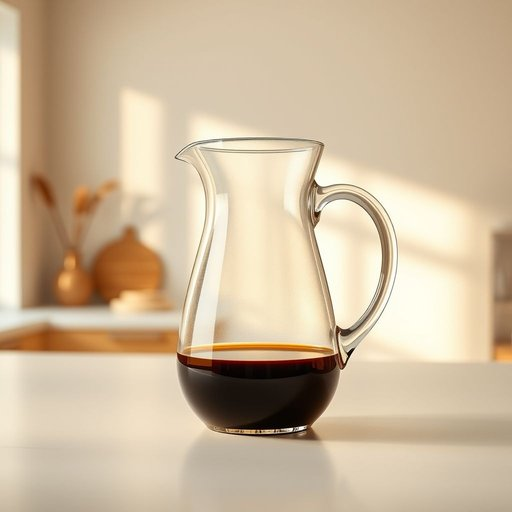

# carafe

<h1 style="font-size: 2.5em; font-weight: 300; letter-spacing: 2px; margin: 0; color: #2c3e50;">
/kəˈræf/
</h1>

---

---

## 例句

After filling the carafe with freshly brewed coffee, she carefully placed it on the kitchen island, where the sunlight streaming through the window highlighted the delicate curves of the glass container, making it not only a functional item but also an elegant centerpiece during their leisurely weekend breakfast.

*After(/ˈæftər/) filling(/ˈfɪlɪŋ/) the(/ðə/) carafe(/kəˈræf/) with(/wɪθ/) freshly(/ˈfrɛʃli/) brewed(/brud/) coffee,(/ˈkɔfi,/) she(/ʃi/) carefully(/ˈkɛrfəli/) placed(/pleɪst/) it(/ɪt/) on(/ɔn/) the(/ðə/) kitchen(/ˈkɪʧən/) island,(/ˈaɪlənd,/) where(/wɛr/) the(/ðə/) sunlight(/ˈsənˌlaɪt/) streaming(/ˈstrimɪŋ/) through(/θru/) the(/ðə/) window(/ˈwɪndoʊ/) highlighted(/ˈhaɪˌlaɪtɪd/) the(/ðə/) delicate(/ˈdɛləkət/) curves(/kərvz/) of(/əv/) the(/ðə/) glass(/glæs/) container,(/kənˈteɪnər,/) making(/ˈmeɪkɪŋ/) it(/ɪt/) not(/nɑt/) only(/ˈoʊnli/) a(/ə/) functional(/ˈfəŋkʃənəl/) item(/ˈaɪtəm/) but(/bət/) also(/ˈɔlsoʊ/) an(/ən/) elegant(/ˈɛləgənt/) centerpiece(/ˈsɛntərˌpis/) during(/ˈdʊrɪŋ/) their(/ðɛr/) leisurely(/ˈlizərli/) weekend(/ˈwiˌkɪnd/) breakfast.(/ˈbrɛkfəst./)*

**翻译：** 她将壶中注满新煮的咖啡后，小心翼翼地将其摆放在厨房岛台上。透过窗户洒进的阳光映照出玻璃壶的优美曲线，使其不仅成为实用之物，更成为他们悠闲周末早餐时光中一道优雅的风景。

---

## 解释

单词“carafe”在家居生活用品的语境中作为名词，指一种通常用玻璃或陶瓷制成的无盖水瓶或醒酒器，常用于盛放水、果汁或红酒，特别是在餐桌上提供饮品时使用。具体使用场合多见于家庭聚餐、餐厅服务或日常饮用水的盛装容器，其设计通常注重实用性与美观，便于倒取且避免饮品受污染。英语学习者使用“carafe”时需注意该词为可数名词，单数形式“a carafe”，复数形式为“carafes”，常见搭配包括“a glass carafe”（玻璃水瓶）、“a wine carafe”（醒酒器）、“a water carafe”（水壶）等，此外，表达时通常搭配动词如“fill”（装满）、“pour from”（从……倒出）、“serve”（供应）。该词源自法语“carafe”，而法语“carafe”又来自意大利语“caraffa”，源于阿拉伯语“gharrafah”，意为“勺子”，描述其取水倒水的功能，其词根体现了人们对容器用途的形象理解。在中文语境下，“carafe”准确翻译为“醒酒器”、“无盖水瓶”或“水壶”，依据具体容器形态和用途而定，无褒贬色彩，但多用于正式或较为雅致的餐桌环境，体现了一种讲求生活品质和饮用体验的文化氛围。

---

<small style="color: #999; font-size: 0.9em;">2025-07-17 06:22:39</small>

