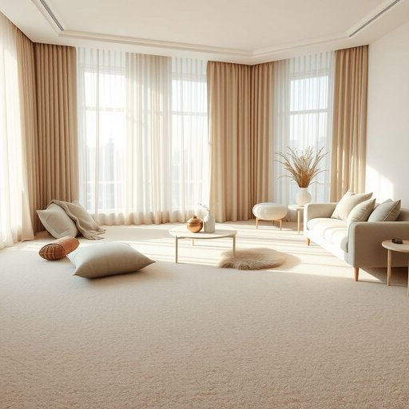

# carpet

<h1 style="font-size: 2.5em; font-weight: 300; letter-spacing: 2px; margin: 0; color: #2c3e50;">
/ˈkɑrpət/
</h1>

---

---

## 例句

Although the carpet in the living room, which was recently fitted to match the new curtains and cushions, has added a cozy warmth to the entire space, we’re considering replacing it with hardwood flooring next year to create a more modern and easy-to-clean environment.

*Although(/ˌɔlˈðoʊ/) the(/ðə/) carpet(/ˈkɑrpət/) in(/ɪn/) the(/ðə/) living(/ˈlɪvɪŋ/) room,(/rum,/) which(/wɪʧ/) was(/wɑz/) recently(/ˈrisəntli/) fitted(/ˈfɪtɪd/) to(/tɪ/) match(/mæʧ/) the(/ðə/) new(/nu/) curtains(/ˈkərtənz/) and(/ənd/) cushions,(/ˈkʊʃənz,/) has(/həz/) added(/ˈædɪd/) a(/ə/) cozy(/ˈkoʊzi/) warmth(/wɔrmθ/) to(/tɪ/) the(/ðə/) entire(/ɪnˈtaɪər/) space,(/speɪs,/) we’re(/we’re*/) considering(/kənˈsɪdərɪŋ/) replacing(/rɪˈpleɪsɪŋ/) it(/ɪt/) with(/wɪθ/) hardwood(/ˈhɑrdˌwʊd/) flooring(/ˈflɔrɪŋ/) next(/nɛkst/) year(/jɪr/) to(/tɪ/) create(/kriˈeɪt/) a(/ə/) more(/mɔr/) modern(/ˈmɑdərn/) and(/ənd/) easy-to-clean(/easy-to-clean*/) environment.(/ɪnˈvaɪrənmənt./)*

**翻译：** 虽然客厅地毯是最近铺设的，以配合新的窗帘和靠垫，为整个空间增添了温馨舒适的氛围，但我们正考虑明年将其替换为硬木地板，以营造更现代且便于清洁的环境。

---

## 解释

英语单词“carpet”作为名词在家居生活用品语境中，主要指覆盖地面的织物材料，通常用于室内地面的装饰和保护，其具体使用场合包括客厅、卧室、办公室等需要增加舒适感和美观度的空间。英语学习者在使用“carpet”时应注意它通常表示整个铺设在地面的地毯或地毯层，与“rug”相比，后者更常指面积较小的独立地毯，此外，“carpet”在语法上为可数名词，复数形式为“carpets”，可以用于表示多块不同的地毯，常见搭配有“wall-to-wall carpet”（全铺地毯）、“carpeted floor”（铺有地毯的地面）、“roll out the carpet”（铺设地毯，亦有比喻引申义“隆重欢迎”），这些表达能够帮助学习者更准确地使用和理解。词源方面，“carpet”一词源自中古法语“carpite”，进而源自拉丁语“carpita”，意为“编织的织物”，反映其作为织物的历史背景。中文里，“carpet”通常译为“地毯”，强调其覆盖地面的功能和装饰性，区别于“地垫”、“地席”等其他铺地用品，需要根据具体大小和材质区别理解。该词在文化上无褒贬含义，但在某些习语或固定搭配中，如“roll out the carpet”，含有礼遇、尊敬的象征意义，使用时应注意语境。总体而言，“carpet”作为家居用品名词是日常生活中常见且实用的词汇，准确理解和运用有助于提升居家环境的描述能力。

---

<small style="color: #999; font-size: 0.9em;">2025-07-17 06:22:39</small>

