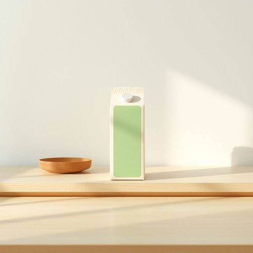

# carton

<h1 style="font-size: 2.5em; font-weight: 300; letter-spacing: 2px; margin: 0; color: #2c3e50;">
/ˈkɑrtən/
</h1>

---

---

## 例句

Could you please pass me that carton of milk from the fridge, the one with the green label that we bought last week, because I need it to finish making the custard for tonight’s dessert?

*Could(/kʊd/) you(/ju/) please(/pliz/) pass(/pæs/) me(/mi/) that(/ðət/) carton(/ˈkɑrtən/) of(/əv/) milk(/mɪlk/) from(/frəm/) the(/ðə/) fridge,(/frɪʤ,/) the(/ðə/) one(/wən/) with(/wɪθ/) the(/ðə/) green(/grin/) label(/ˈleɪbəl/) that(/ðət/) we(/wi/) bought(/bɔt/) last(/læst/) week,(/wik,/) because(/bɪˈkəz/) I(/aɪ/) need(/nid/) it(/ɪt/) to(/tɪ/) finish(/ˈfɪnɪʃ/) making(/ˈmeɪkɪŋ/) the(/ðə/) custard(/ˈkəstərd/) for(/fər/) tonight’s(/tonight’s*/) dessert?(/dɪˈzərt?/)*

**翻译：** 请你帮我从冰箱里拿一下那盒牛奶，就是上周买的那个绿色标签的，因为我需要用它来完成今晚甜点的蛋奶冻制作。

---

## 解释

英语单词“carton”作为名词在家居生活用品的语境中，通常指装液体或固体商品的纸盒或纸板箱，常见于包装牛奶、果汁、鸡蛋等食品，也包括小型纸盒包装的商品。具体使用场合多见于超市购物、家庭储存或食品包装说明中，如“The milk comes in a carton”（牛奶装在纸盒里）。“carton”在语法上通常作可数名词，复数形式为“cartons”，常见搭配包括“一 carton of milk”（一盒牛奶）、“a carton of eggs”（一盒鸡蛋）以及动词短语“pack in cartons”（装入纸盒）。英语学习者需注意“carton”不同于“box”，“carton”一般指由纸或纸板制成较轻薄的包装，而“box”可能是木制或塑料制的较硬容器。词源上，“carton”源自法语“carton”，意为硬纸板，进一步来自意大利语“cartone”，表示较厚的纸板，这表明其材质和功能特征。中文语境中，“carton”常译为“纸盒”或“纸板箱”，强调其用纸或纸板材质且用于包装的属性，不能简单替代为“箱子”或“盒子”，因为这些词没有限定材质。总的来说，“carton”在家居生活中指的是轻便且常见用于包装食品等物品的纸质包装容器，语义中无褒贬色彩，属于中性词，但因其材质和用途明确，使用时需根据具体物品选择恰当的翻译和搭配。

---

<small style="color: #999; font-size: 0.9em;">2025-07-17 06:22:39</small>

