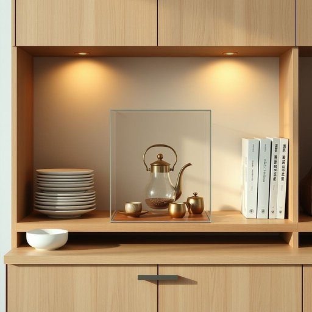

# case

<h1 style="font-size: 2.5em; font-weight: 300; letter-spacing: 2px; margin: 0; color: #2c3e50;">
/keɪs/
</h1>

---

---

## 例句

In the kitchen cabinet, right next to the neatly stacked plates and the worn-out recipe books, there’s a delicate glass case that my grandmother gave me, which I always use to store my vintage tea set because it not only protects the fragile cups from dust but also adds a charming, old-fashioned touch to the entire dining area.

*In(/ɪn/) the(/ðə/) kitchen(/ˈkɪʧən/) cabinet,(/ˈkæbənət,/) right(/raɪt/) next(/nɛkst/) to(/tɪ/) the(/ðə/) neatly(/ˈnitli/) stacked(/stækt/) plates(/pleɪts/) and(/ənd/) the(/ðə/) worn-out(/worn-out*/) recipe(/ˈrɛsəpi/) books,(/bʊks,/) there’s(/there’s*/) a(/ə/) delicate(/ˈdɛləkət/) glass(/glæs/) case(/keɪs/) that(/ðət/) my(/maɪ/) grandmother(/ˈgrændˌməðər/) gave(/geɪv/) me,(/mi,/) which(/wɪʧ/) I(/aɪ/) always(/ˈɔlˌweɪz/) use(/juz/) to(/tɪ/) store(/stɔr/) my(/maɪ/) vintage(/ˈvɪntɪʤ/) tea(/ti/) set(/sɛt/) because(/bɪˈkəz/) it(/ɪt/) not(/nɑt/) only(/ˈoʊnli/) protects(/prəˈtɛkts/) the(/ðə/) fragile(/ˈfræʤəl/) cups(/kəps/) from(/frəm/) dust(/dəst/) but(/bət/) also(/ˈɔlsoʊ/) adds(/ædz/) a(/ə/) charming,(/ˈʧɑrmɪŋ,/) old-fashioned(/ˌoʊldˈfæʃənd/) touch(/təʧ/) to(/tɪ/) the(/ðə/) entire(/ɪnˈtaɪər/) dining(/ˈdaɪnɪŋ/) area.(/ˈɛriə./)*

**翻译：** 在厨房橱柜里，就放在整齐叠放的盘子和有些破旧的食谱书旁边，有一个我奶奶送给我的精致玻璃盒。我总是用它来收藏我的复古茶具，因为它不仅能保护易碎的茶杯免受灰尘污染，还为整个餐区增添了一抹迷人而古朴的风情。

---

## 解释

在家居生活用品的语境中，英语单词“case”作为名词通常指用于存放、保护或携带物品的盒子、箱子或套子，如眼镜盒、首饰盒、刀具盒等。这种用法多见于具体表示物理容器的场合，如厨房、卧室或办公环境中存放物品的容器或收纳工具。英语学习者在使用“case”时应注意其单复数变化，单数为case，复数为cases，且常见搭配有“一盒、一箱”（a case of，如a case of wine），或与形容词连用表示材质（a leather case皮革盒）或用途（a pencil case铅笔盒）。此外，“case”也可与动词搭配，如“put something in a case”（把某物装入盒中）等。词源上，“case”源自拉丁语“capsa”，意为盒子、箱子，经过法语进入英语，保留了其“容器”之义。在中文语境中，应准确翻译为“盒子”、“箱子”或“套”，根据具体物品确定，如“眼镜盒”“手表盒”等，避免误译为抽象的“情况”或“案件”。该词在家居用品中一般无褒贬色彩，属于中性词，使用时注重具体指代的物理容器即可，符合生活实际，方便表达物品的收纳与保护功能。

---

<small style="color: #999; font-size: 0.9em;">2025-07-17 06:22:39</small>

