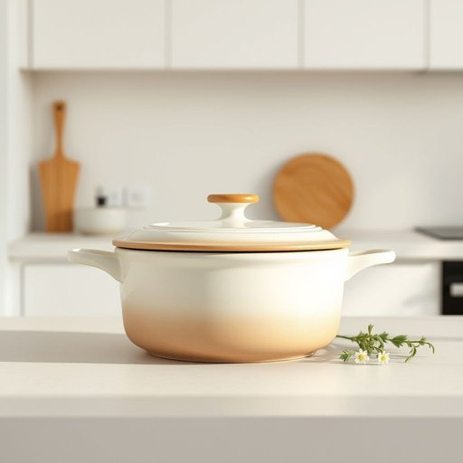

# casserole

<h1 style="font-size: 2.5em; font-weight: 300; letter-spacing: 2px; margin: 0; color: #2c3e50;">
/ˈkæsərˌoʊl/
</h1>

---

---

## 例句

After unpacking the groceries, she carefully placed the new casserole, which was both ovenproof and surprisingly lightweight, on the kitchen counter, explaining that it was perfect not only for slow-cooked stews but also for serving family dinners without the hassle of multiple dishes.

*After(/ˈæftər/) unpacking(/ənˈpækɪŋ/) the(/ðə/) groceries,(/ˈgroʊsəriz,/) she(/ʃi/) carefully(/ˈkɛrfəli/) placed(/pleɪst/) the(/ðə/) new(/nu/) casserole,(/ˈkæsərˌoʊl,/) which(/wɪʧ/) was(/wɑz/) both(/boʊθ/) ovenproof(/ovenproof*/) and(/ənd/) surprisingly(/səˈpraɪzɪŋli/) lightweight,(/ˈlaɪtˈweɪt,/) on(/ɔn/) the(/ðə/) kitchen(/ˈkɪʧən/) counter,(/ˈkaʊntər,/) explaining(/ɪkˈspleɪnɪŋ/) that(/ðət/) it(/ɪt/) was(/wɑz/) perfect(/ˈpərˌfɪkt/) not(/nɑt/) only(/ˈoʊnli/) for(/fər/) slow-cooked(/slow-cooked*/) stews(/stuz/) but(/bət/) also(/ˈɔlsoʊ/) for(/fər/) serving(/ˈsərvɪŋ/) family(/ˈfæməli/) dinners(/ˈdɪnərz/) without(/wɪˈθaʊt/) the(/ðə/) hassle(/ˈhæsəl/) of(/əv/) multiple(/ˈməltəpəl/) dishes.(/ˈdɪʃɪz./)*

**翻译：** 她整理好买来的食品后，小心翼翼地将那只既耐高温又意外轻便的新砂锅放在厨房台面上，解释说它不仅非常适合慢炖的炖菜，也方便直接端上家宴，省去了洗多只餐具的麻烦。

---

## 解释

英语单词“casserole”作为名词在家居生活用品语境中通常指一种带盖的深底烤盘或砂锅，用于在烤箱中烹饪和加热食物，特别适合炖煮、焗烤或焖煮食材。它通常由陶瓷、玻璃或铸铁等材质制成，既可用于烹饪也可直接端上餐桌，体现了其实用与美观兼备的特点。使用该词时，英语学习者应注意其不可数和可数用法，通常指容器时为可数名词（a casserole），也可指菜肴本身，如“a chicken casserole”，此时后者为可数。常见搭配有“casserole dish”、“casserole pan”、“to bake a casserole”等，表达时强调烹饪方式和器具。词源上，“casserole”源自法语，意为“平底锅”，进一步源自中世纪拉丁语“cattia”，反映了其作为烹饪器具的历史背景。在中文语境中，“casserole”准确翻译为“砂锅”或“烤盘”，在不同地区习惯有所差别，前者多指陶瓷砂锅，后者多指金属或玻璃材质的烤盘；引申指代“砂锅菜”或“焗烤菜肴”时需根据上下文选择恰当译法。该词在英语中中性且常用于家庭烹饪，无褒贬含义，但由于其经常与家庭温馨、便捷烹饪联系在一起，带有一定的生活化和舒适感的文化色彩。

---

<small style="color: #999; font-size: 0.9em;">2025-07-17 06:22:39</small>

