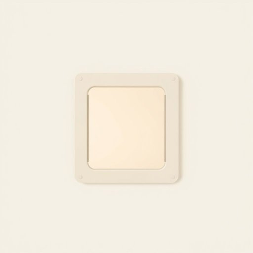

# catflap

<h1 style="font-size: 2.5em; font-weight: 300; letter-spacing: 2px; margin: 0; color: #2c3e50;">
/catflap*/
</h1>

---

---

## 例句

Although the catflap we installed last autumn to give Whiskers the freedom to come and go as she pleases occasionally lets in a draught on chilly evenings, it has undoubtedly made our lives easier by preventing her from meowing incessantly at the door every time she wants to venture outside or return indoors.

*Although(/ˌɔlˈðoʊ/) the(/ðə/) catflap(/catflap*/) we(/wi/) installed(/ˌɪnˈstɔld/) last(/læst/) autumn(/ˈɔtəm/) to(/tɪ/) give(/gɪv/) Whiskers(/ˈwɪskərz/) the(/ðə/) freedom(/ˈfridəm/) to(/tɪ/) come(/kəm/) and(/ənd/) go(/goʊ/) as(/ɛz/) she(/ʃi/) pleases(/ˈplizɪz/) occasionally(/ɔˈkeɪʒənəˌli/) lets(/lɛts/) in(/ɪn/) a(/ə/) draught(/dræft/) on(/ɔn/) chilly(/ˈʧɪli/) evenings,(/ˈivnɪŋz,/) it(/ɪt/) has(/həz/) undoubtedly(/ənˈdaʊtɪdli/) made(/meɪd/) our(/ɑr/) lives(/lɪvz/) easier(/ˈiziər/) by(/baɪ/) preventing(/prɪˈvɛnɪŋ/) her(/hər/) from(/frəm/) meowing(/meowing*/) incessantly(/ˌɪnˈsɛsəntli/) at(/æt/) the(/ðə/) door(/dɔr/) every(/ˈɛvəri/) time(/taɪm/) she(/ʃi/) wants(/wɔnts/) to(/tɪ/) venture(/ˈvɛnʧər/) outside(/ˈaʊtˈsaɪd/) or(/ər/) return(/rɪˈtərn/) indoors.(/ˈɪnˌdɔrz./)*

**翻译：** 虽然我们去年秋天安装的猫门偶尔在寒冷的夜晚会透进一丝冷风，但毫无疑问，它让我们的生活变得更加轻松，因为每当胡须想要外出或回屋时，不再不断地在门前喵喵叫了。

---

## 解释

“catflap”作为名词，主要指安装在门或墙上供猫进出的小型活动门，常见于家庭或宠物养护环境中。具体使用场合通常是在谈论宠物设施、家居改造或宠物自由活动的语境中，比如“I installed a catflap so my cat can go outside freely”（我装了一个猫门，让我的猫可以自由出入）。英语学习者需要注意，“catflap”是一个复合名词，常见的搭配有“install a catflap”（安装猫门）、“fit a catflap”（装置猫门）和“use a catflap”（使用猫门）等。语法上，“catflap”作为可数名词，其复数形式为“catflaps”。此外，它可直接作名词使用，不需要冠词时也可出现，如“Catflap lets the cat in”（猫门让猫进来），但在具体指某一个时通常用定冠词“the”。词源上，“catflap”由“cat”（猫）和“flap”（垂下的门板）组成，形象地描述了一个专为猫设计的可自由开启的门扇，起源于20世纪中期英语口语中对这种宠物门的小称。中文语境中，“catflap”一般翻译为“猫门”或“猫洞”，强调其作为猫进出通道的小型活动门的功能，通常没有褒贬意义，是一种中性词汇。在日常家居语境中使用时，能够准确传达宠物便利设施的概念，反映现代家庭对宠物生活自由度的关注。

---

<small style="color: #999; font-size: 0.9em;">2025-07-17 06:22:39</small>

