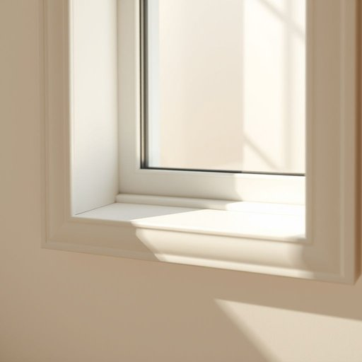

# caulk

<h1 style="font-size: 2.5em; font-weight: 300; letter-spacing: 2px; margin: 0; color: #2c3e50;">
/kɔk/
</h1>

---

---

## 例句

Before the meeting's start, the careful removal of the old caulk was necessary to prevent damage.

*Before(/ˌbiˈfɔr/) the(/ðə/) meeting's(/ˈmitɪŋz/) start,(/stɑrt,/) the(/ðə/) careful(/ˈkɛrfəl/) removal(/rɪˈmuvəl/) of(/əv/) the(/ðə/) old(/oʊld/) caulk(/kɔk/) was(/wɑz/) necessary(/ˈnɛsəˌsɛri/) to(/tɪ/) prevent(/prɪˈvɛnt/) damage.(/ˈdæmɪʤ./)*

**翻译：** 会议开始前，需仔细清除旧密封胶，以防止损坏。

---

## 解释

英语单词“caulk”作为名词在家居生活用品语境中，指的是一种用于填补缝隙、防水、防漏的密封材料，常见于浴室、厨房、水槽、窗框或门边等需要防潮防风的地方，使用场合多为家庭装修或维修中防止水汽渗透或空气漏流。英语学习者使用“caulk”时应注意其名词形式一般指的是“密封物”或“填缝剂”，语法上常与限定词连用，如“一条密封剂”（a bead of caulk），也可与动词“apply”搭配，即“涂抹密封剂”（apply caulk），而作为动词时表示“填塞缝隙”，动词和名词两用需区分。常见搭配有“硅胶密封剂”（silicone caulk）、“窗户密封剂”（window caulk）等。词源上，“caulk”一词来源于中古英语，最初指船体缝隙的密封材料，源自古法语“calfeutrer”，意为“堵塞、填塞”，其用途从造船演变到家居密封，体现了密封防护的核心功能。在中文语境中，“caulk”作为名词通常准确翻译为“密封剂”或“填缝剂”，强调其填补缝隙、阻隔水和空气的作用，无明显褒贬色彩，属于中性专业词汇，常见于装修建材领域。理解时应区分其与“sealant（密封材料）”的细微差别，前者更侧重填缝功能，后者范围更广。整体来说，“caulk”指的就是一种特定用途的密封填充材料，是家居生活中防水防漏必不可少的用品。

---

<small style="color: #999; font-size: 0.9em;">2025-07-17 06:22:39</small>

