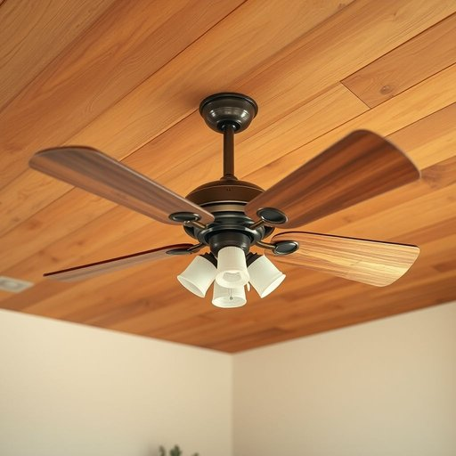

# ceiling-fan

<h1 style="font-size: 2.5em; font-weight: 300; letter-spacing: 2px; margin: 0; color: #2c3e50;">
/ceiling-fan*/
</h1>

---

---

## 例句

Although the old ceiling-fan in the living room creaked loudly whenever it was switched on, providing both a much-needed breeze during the stifling summer evenings and an ambient, gentle whirring sound, we decided to keep it for its vintage charm rather than replace it with a modern, noiseless alternative.

*Although(/ˌɔlˈðoʊ/) the(/ðə/) old(/oʊld/) ceiling-fan(/ceiling-fan*/) in(/ɪn/) the(/ðə/) living(/ˈlɪvɪŋ/) room(/rum/) creaked(/krikt/) loudly(/ˈlaʊdli/) whenever(/wɛˈnɛvər/) it(/ɪt/) was(/wɑz/) switched(/swɪʧt/) on,(/ɔn,/) providing(/prəˈvaɪdɪŋ/) both(/boʊθ/) a(/ə/) much-needed(/much-needed*/) breeze(/briz/) during(/ˈdʊrɪŋ/) the(/ðə/) stifling(/ˈstaɪfəlɪŋ/) summer(/ˈsəmər/) evenings(/ˈivnɪŋz/) and(/ənd/) an(/ən/) ambient,(/ˈæmbiənt,/) gentle(/ˈʤɛnəl/) whirring(/wərɪŋ/) sound,(/saʊnd,/) we(/wi/) decided(/ˌdɪˈsaɪdɪd/) to(/tɪ/) keep(/kip/) it(/ɪt/) for(/fər/) its(/ɪts/) vintage(/ˈvɪntɪʤ/) charm(/ʧɑrm/) rather(/ˈrəðər/) than(/ðən/) replace(/ˌriˈpleɪs/) it(/ɪt/) with(/wɪθ/) a(/ə/) modern,(/ˈmɑdərn,/) noiseless(/noiseless*/) alternative.(/ɔlˈtərnətɪv./)*

**翻译：** 尽管客厅里那台旧吊扇每次开启时都会发出刺耳的吱吱声，既在闷热的夏夜带来了急需的微风，也伴随着柔和的嗡嗡声营造出氛围，我们还是决定保留它，因其独特的复古魅力，而非用现代无声的款式替代。

---

## 解释

“ceiling-fan”作为名词，指的是安装在天花板上的电风扇，通常用于室内空气流通和降温，广泛应用于家庭、办公室及公共场所的居住或工作环境中。在具体使用场合上，英语学习者多见于谈论家居设备、电器或室内环境舒适度时，如描述房间的配备或讨论如何避免高温；常用搭配包括“turn on the ceiling fan（打开吊扇）”、“a noisy ceiling fan（吵闹的吊扇）”、“install a ceiling fan（安装吊扇）”等，语法上该词为复合名词，整体作为单数或复数形式（ceiling fans）使用，需注意连字符的使用，有时在非正式语境下也写作“ceiling fan”不连字符，但标准书面语更倾向于连字符形式以明确词义。词源方面，“ceiling”源自古英语“ceilian”，意指盖顶或天花板，“fan”则来自拉丁语“vannus”，意为扇子，二者组合直观表达安装于天花板的风扇这一概念。中文语境中，“ceiling-fan”准确对应“吊扇”或“天花板风扇”，强调其安装位置和功能，避免与普通的桌扇或落地扇混淆。此词无明显褒贬色彩，属中性词汇，文化意义上反映出热带及温暖气候区常用的一种经济实用的降温设备，兼具省电和空气流通的特点，理解时应关注其作为固定家居用品的角色。

---

<small style="color: #999; font-size: 0.9em;">2025-07-17 06:22:39</small>

