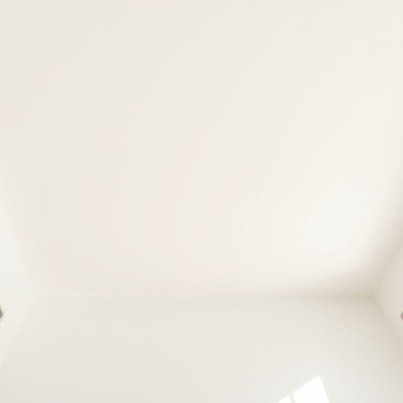

# ceiling

<h1 style="font-size: 2.5em; font-weight: 300; letter-spacing: 2px; margin: 0; color: #2c3e50;">
/ˈsilɪŋ/
</h1>

---

---

## 例句

Although the ceiling, which was originally painted a bright white to reflect natural light and make the room appear more spacious, has recently developed a few stubborn stains near the corners—likely due to minor leaks from the roof—we've decided to leave it as is for now, since repainting would require moving all the furniture and could disrupt the entire living room for several days.

*Although(/ˌɔlˈðoʊ/) the(/ðə/) ceiling,(/ˈsilɪŋ,/) which(/wɪʧ/) was(/wɑz/) originally(/ərˈɪʤənəli/) painted(/ˈpeɪnɪd/) a(/ə/) bright(/braɪt/) white(/waɪt/) to(/tɪ/) reflect(/rɪˈflɛkt/) natural(/ˈnæʧərəl/) light(/laɪt/) and(/ənd/) make(/meɪk/) the(/ðə/) room(/rum/) appear(/əˈpɪr/) more(/mɔr/) spacious,(/ˈspeɪʃəs,/) has(/həz/) recently(/ˈrisəntli/) developed(/dɪˈvɛləpt/) a(/ə/) few(/fju/) stubborn(/ˈstəbərn/) stains(/steɪnz/) near(/nɪr/) the(/ðə/) corners—likely(/corners—likely*/) due(/du/) to(/tɪ/) minor(/ˈmaɪnər/) leaks(/liks/) from(/frəm/) the(/ðə/) roof—we've(/roof—we've*/) decided(/ˌdɪˈsaɪdɪd/) to(/tɪ/) leave(/liv/) it(/ɪt/) as(/ɛz/) is(/ɪz/) for(/fər/) now,(/naʊ,/) since(/sɪns/) repainting(/riˈpeɪntɪŋ/) would(/wʊd/) require(/ˌrikˈwaɪər/) moving(/ˈmuvɪŋ/) all(/ɔl/) the(/ðə/) furniture(/ˈfərnɪʧər/) and(/ənd/) could(/kʊd/) disrupt(/dɪsˈrəpt/) the(/ðə/) entire(/ɪnˈtaɪər/) living(/ˈlɪvɪŋ/) room(/rum/) for(/fər/) several(/ˈsɛvərəl/) days.(/deɪz./)*

**翻译：** 虽然天花板最初涂刷的是明亮的白色，以反射自然光线并使房间看起来更加宽敞，但最近靠近角落处出现了几处顽固的污渍，可能是由于屋顶的轻微漏水所致——我们决定暂时保持原状，因为重新粉刷需要搬动所有家具，且可能会扰乱整个客厅数日。

---

## 解释

英语单词"ceiling"在家居生活用品语境中作为名词，主要指房屋内部空间顶部的平面结构，即“天花板”或“顶棚”，是覆盖和保护室内上方空间的构造部分，使用场合包括描述室内装修、建筑设计或家装讨论中对室内空间的顶部描述。英语学习者在使用"ceiling"时需注意其可数名词身份，通常用单数形式指一间房内的顶棚，也可用复数形式指多个房间的天花板；常见搭配有“paint the ceiling”（粉刷天花板）、“high/low ceiling”（高/低天花板）、“ceiling fan”（吊扇）等；此外，短语“hit the ceiling”虽属习语，但意义偏离字面指“非常生气”，需区分。词源方面，"ceiling"源自中古英语"ceil"（覆盖、覆盖面）与后缀“-ing”结合，最初指覆盖或覆盖物，后来专指室内顶部的覆盖面。中文语境中，"ceiling"准确翻译为“天花板”或“顶棚”，是家居装修中不可或缺的组成部分，理解时应侧重其物理空间位置和功能，通常无贬义色彩，属于中性词汇，但在文化表达中可衍生比喻义（如限制或上限），需根据语境判断。

---

<small style="color: #999; font-size: 0.9em;">2025-07-17 06:22:39</small>

