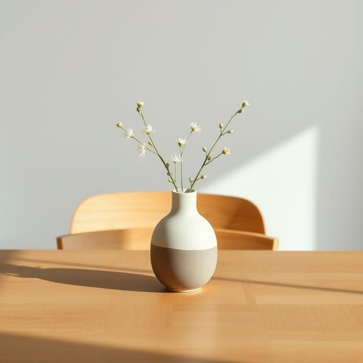

# centerpiece

<h1 style="font-size: 2.5em; font-weight: 300; letter-spacing: 2px; margin: 0; color: #2c3e50;">
/ˈsɛntərˌpis/
</h1>

---

---

## 例句

The dining table looked absolutely stunning last night, especially because the handcrafted ceramic vase, which served as the centerpiece, was filled with fresh wildflowers that added a delicate splash of colour and a subtle, natural fragrance, perfectly complementing the rustic wooden furniture and the soft, ambient lighting in the room.

*The(/ðə/) dining(/ˈdaɪnɪŋ/) table(/ˈteɪbəl/) looked(/lʊkt/) absolutely(/ˌæbsəˈlutli/) stunning(/ˈstənɪŋ/) last(/læst/) night,(/naɪt,/) especially(/əˈspɛʃəli/) because(/bɪˈkəz/) the(/ðə/) handcrafted(/ˈhændˌkræftɪd/) ceramic(/sərˈæmɪk/) vase,(/vɑz,/) which(/wɪʧ/) served(/sərvd/) as(/ɛz/) the(/ðə/) centerpiece,(/ˈsɛntərˌpis,/) was(/wɑz/) filled(/fɪld/) with(/wɪθ/) fresh(/frɛʃ/) wildflowers(/ˈwaɪldˌflaʊrz/) that(/ðət/) added(/ˈædɪd/) a(/ə/) delicate(/ˈdɛləkət/) splash(/splæʃ/) of(/əv/) colour(/ˈkələr/) and(/ənd/) a(/ə/) subtle,(/ˈsətəl,/) natural(/ˈnæʧərəl/) fragrance,(/ˈfreɪgrəns,/) perfectly(/ˈpərfəktli/) complementing(/ˈkɑmpləˌmɛntɪŋ/) the(/ðə/) rustic(/ˈrəstɪk/) wooden(/ˈwʊdən/) furniture(/ˈfərnɪʧər/) and(/ənd/) the(/ðə/) soft,(/sɔft,/) ambient(/ˈæmbiənt/) lighting(/ˈlaɪtɪŋ/) in(/ɪn/) the(/ðə/) room.(/rum./)*

**翻译：** 昨晚的餐桌看起来格外迷人，尤其是那只手工制作的陶瓷花瓶作为餐桌中央装饰，里面插满了新鲜的野花，带来细腻的色彩点缀和淡雅的自然芳香，与质朴的木质家具和柔和的环境灯光相得益彰。

---

## 解释

英语单词centerpiece在家居生活用品场景中作为名词通常指摆放在餐桌中央或客厅主要位置的装饰物如花卉装饰烛台雕塑等起到视觉焦点和美化环境的作用具体使用场合多见于家庭聚会节日餐宴正式宴会或日常家居布置中用于强调某件装饰品在整体布局中的重要地位英语学习者使用该词时应注意其复数形式为centerpieces且常与dining table餐桌holiday节日floral花卉的decor装饰等词搭配如a floral centerpiece或the centerpiece of the dining table表达更加自然同时centerpiece也可以比喻为某事物或活动的核心或最重要部分需要根据上下文辨别其具体含义该词源自center意为中心加上piece意为物件指居中放置的物件最早用于描述家具或饰品的核心部分后引申为装饰品或关键元素在中文语境中准确翻译为餐桌中央摆饰或桌面中心装饰品既反映其实际位置也强调其装饰作用此词通常为中性词无明显褒贬或特殊文化内涵但在正式场合使用时表示讲究与用心布置的生活态度有时也象征着家庭或社交活动的重视和礼仪

---

<small style="color: #999; font-size: 0.9em;">2025-07-17 06:22:39</small>

