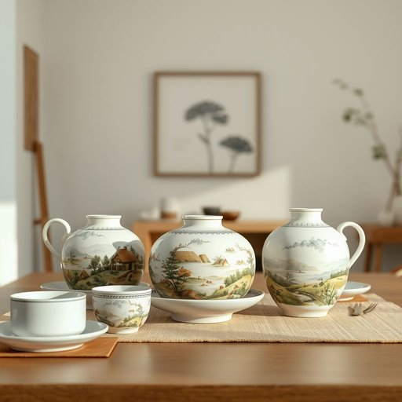

# ceramics

<h1 style="font-size: 2.5em; font-weight: 300; letter-spacing: 2px; margin: 0; color: #2c3e50;">
/sərˈæmɪks/
</h1>

---

---

## 例句

Although the ceramics we bought from that quaint little shop down the lane are quite delicate, the intricate hand-painted designs, which vividly depict scenes of rural England, make them an indispensable part of our dining room décor, especially when we host family dinners and want to impress our guests with something both traditional and aesthetically pleasing.

*Although(/ˌɔlˈðoʊ/) the(/ðə/) ceramics(/sərˈæmɪks/) we(/wi/) bought(/bɔt/) from(/frəm/) that(/ðət/) quaint(/kweɪnt/) little(/ˈlɪtəl/) shop(/ʃɑp/) down(/daʊn/) the(/ðə/) lane(/leɪn/) are(/ər/) quite(/kwaɪt/) delicate,(/ˈdɛləkət,/) the(/ðə/) intricate(/ˈɪntrəkət/) hand-painted(/hand-painted*/) designs,(/dɪˈzaɪnz,/) which(/wɪʧ/) vividly(/ˈvɪvədli/) depict(/dɪˈpɪkt/) scenes(/sinz/) of(/əv/) rural(/ˈrʊrəl/) England,(/ˈɪŋglənd,/) make(/meɪk/) them(/ðɛm/) an(/ən/) indispensable(/ˌɪndɪˈspɛnsəbəl/) part(/pɑrt/) of(/əv/) our(/ɑr/) dining(/ˈdaɪnɪŋ/) room(/rum/) décor,(/décor*,/) especially(/əˈspɛʃəli/) when(/wɪn/) we(/wi/) host(/hoʊst/) family(/ˈfæməli/) dinners(/ˈdɪnərz/) and(/ənd/) want(/wɔnt/) to(/tɪ/) impress(/ˌɪmˈprɛs/) our(/ɑr/) guests(/gɛsts/) with(/wɪθ/) something(/ˈsəmθɪŋ/) both(/boʊθ/) traditional(/trəˈdɪʃənəl/) and(/ənd/) aesthetically(/ɛsˈθɛtɪkli/) pleasing.(/ˈplizɪŋ./)*

**翻译：** 虽然我们从那条小巷尽头那个别致的小店里买的瓷器相当娇嫩，但其精致的手绘图案生动描绘了英格兰乡村的景象，使它们成为我们餐厅装饰中不可或缺的一部分，尤其是在我们举办家庭聚餐时，更能以既传统又赏心悦目的方式给宾客留下深刻印象。

---

## 解释

英语单词"ceramics"作为名词，在家居生活用品的语境中通常指的是由陶土或瓷土经过成型和高温烧制而成的器皿、装饰品或建材制品，如陶瓷杯、瓷盘、花瓶等，常用于厨房用具、餐具或室内装饰，出现于购买、描述或设计家居用品时的交流场合。学习者在使用"ceramics"时应注意其复数形式，通常作为复数名词使用，统一指代此类陶瓷制品，而非单一具体物品；常见搭配包括"ceramics collection"（陶瓷收藏）、"ceramics workshop"（陶艺工作坊）、"ceramics industry"（陶瓷产业）等，表达时可搭配形容词如"beautiful ceramics"（精美的陶瓷）或动画词"make ceramics"（制作陶瓷）。词源上，"ceramics"源自希腊语“keramikos”，意指与陶器相关的工艺，经过拉丁语和法语传入英语，反映其根植于古老的陶器制造技术。中文语境中，"ceramics"在家居用品领域一般翻译为“陶瓷”，涵盖陶器和瓷器，指日常生活中用到的各种陶瓷制品，没有褒贬色彩，是中性且广泛接受的专业及生活用语，文化内涵中陶瓷常象征精致、传统工艺与美学，体现一定的文化价值和艺术气息。

---

<small style="color: #999; font-size: 0.9em;">2025-07-17 06:22:39</small>

