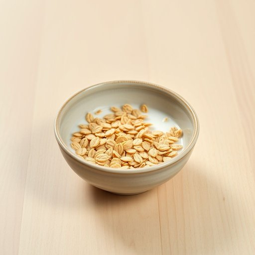

# cereal

<h1 style="font-size: 2.5em; font-weight: 300; letter-spacing: 2px; margin: 0; color: #2c3e50;">
/ˈsɪriəl/
</h1>

---

---

## 例句

While rummaging through the kitchen cupboards to find something quick for breakfast, she realised that the only cereal left was a half-empty box of bran flakes, which, despite being healthy, nobody in the family particularly enjoyed eating on a gloomy Sunday morning when everyone craved something sweeter.

*While(/waɪl/) rummaging(/ˈrəmɪʤɪŋ/) through(/θru/) the(/ðə/) kitchen(/ˈkɪʧən/) cupboards(/ˈkəbərdz/) to(/tɪ/) find(/faɪnd/) something(/ˈsəmθɪŋ/) quick(/kwɪk/) for(/fər/) breakfast,(/ˈbrɛkfəst,/) she(/ʃi/) realised(/ˈriəˌlaɪzd/) that(/ðət/) the(/ðə/) only(/ˈoʊnli/) cereal(/ˈsɪriəl/) left(/lɛft/) was(/wɑz/) a(/ə/) half-empty(/half-empty*/) box(/bɑks/) of(/əv/) bran(/bræn/) flakes,(/fleɪks,/) which,(/wɪʧ,/) despite(/dɪˈspaɪt/) being(/biɪŋ/) healthy,(/ˈhɛlθi,/) nobody(/ˈnoʊˌbɑˌdi/) in(/ɪn/) the(/ðə/) family(/ˈfæməli/) particularly(/ˌpɑrˈtɪkjələrli/) enjoyed(/ˌɛnˈʤɔɪd/) eating(/ˈitɪŋ/) on(/ɔn/) a(/ə/) gloomy(/ˈglumi/) Sunday(/ˈsənˌdi/) morning(/ˈmɔrnɪŋ/) when(/wɪn/) everyone(/ˈɛvriˌwən/) craved(/kreɪvd/) something(/ˈsəmθɪŋ/) sweeter.(/sˈwitər./)*

**翻译：** 当她在厨房橱柜里翻找着想找些快捷的早餐时，发现唯一剩下的谷物只有半盒麦麸片，虽然健康，但家里没人特别喜欢在阴郁的星期天早晨吃这种东西，那时大家更渴望些甜味的食物。

---

## 解释

英语单词“cereal”作为名词在家居生活用品的场景中，通常指供早餐食用的谷类食品，如玉米片、燕麦片等，这些产品往往包装成方便即食的形式，常搭配牛奶食用。使用“cereal”时，需注意其作为可数名词时多指不同种类的谷物（如a type of cereal），而不可数时泛指谷类食品整体（如eat cereal for breakfast）；此外，常见搭配包括“cereal box”（谷物包装盒）、“bowl of cereal”（一碗谷物食品）、“breakfast cereal”（早餐谷物）。从词源角度看，“cereal”源自拉丁语“Cereris”，指罗马农业女神Ceres，象征丰收和谷物，因此最初与谷物作物直接相关。中文语境中，“cereal”一般准确翻译为“谷类食品”或“谷物早餐”，侧重于指代用各种谷物制成的即食早餐食品，无褒贬色彩，属于日常饮食中的中性词汇。在文化层面，“cereal”关联西方国家早餐习惯，强调快速便捷与营养均衡，学习者应了解其在家庭日常生活中作为常见食品的角色。

---

<small style="color: #999; font-size: 0.9em;">2025-07-17 06:22:39</small>

