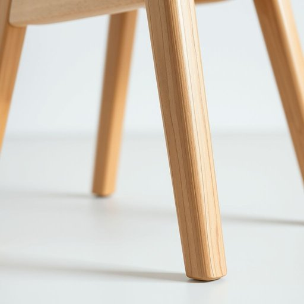

# chair-leg

<h1 style="font-size: 2.5em; font-weight: 300; letter-spacing: 2px; margin: 0; color: #2c3e50;">
/chair-leg*/
</h1>

---

---

## 例句

When the table in the conference room was unexpectedly rearranged to face the window, the chair became the focal point of a heated debate about the best seating arrangement to foster collaboration among the team members.

*When(/wɪn/) the(/ðə/) table(/ˈteɪbəl/) in(/ɪn/) the(/ðə/) conference(/ˈkɑnfərəns/) room(/rum/) was(/wɑz/) unexpectedly(/ˌənɪkˈspɛktɪdli/) rearranged(/riəreɪnʤd/) to(/tɪ/) face(/feɪs/) the(/ðə/) window,(/ˈwɪndoʊ,/) the(/ðə/) chair(/ʧɛr/) became(/bɪˈkeɪm/) the(/ðə/) focal(/ˈfoʊkəl/) point(/pɔɪnt/) of(/əv/) a(/ə/) heated(/ˈhitɪd/) debate(/dəˈbeɪt/) about(/əˈbaʊt/) the(/ðə/) best(/bɛst/) seating(/ˈsitɪŋ/) arrangement(/ərˈeɪnʤmənt/) to(/tɪ/) foster(/ˈfɑstər/) collaboration(/kəˌlæbərˈeɪʃən/) among(/əˈməŋ/) the(/ðə/) team(/tim/) members.(/ˈmɛmbərz./)*

**翻译：** 当会议室的桌子意外被重新摆放，面向窗户时，椅子成了激烈讨论的焦点，大家热议如何安排座位才能更好地促进团队成员之间的协作。

---

## 解释

作为名词，“chair-leg”指椅子的腿部结构，主要用于支撑椅子的主体，使其稳固地站立在地面上，常见于家具和家居生活用品相关场合，如家具设计、维修、家装描述或购买椅子时的具体部件说明。在英语学习中，“chair-leg”是一个复合名词，通常作为单数或复数形式出现，复数为“chair legs”，多用于具体指代某一把椅子的腿或椅子腿的整体。常见搭配有“broken chair leg”（断了的椅子腿）、“replace the chair leg”（更换椅子腿）、“wooden chair legs”（木制椅子腿）等。通常“chair-leg”不作单独形容词使用，而作为复合名词整体出现。该词由“chair”（椅子）与“leg”（腿）直接组合形成，是构词法中复合名词的典型例子，反映物体部件的直接命名方式。中文中，“chair-leg”翻译为“椅子腿”，强调椅子支撑部分的具体物理部件，无特殊褒贬含义或文化色彩，仅作客观描述使用。在日常生活中，理解和使用该词能够准确表达家具部件，方便交流和处理相关家居事务。

---

<small style="color: #999; font-size: 0.9em;">2025-07-17 06:22:39</small>

