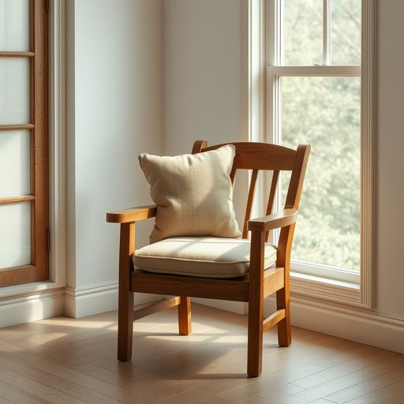

# chair

<h1 style="font-size: 2.5em; font-weight: 300; letter-spacing: 2px; margin: 0; color: #2c3e50;">
/ʧɛr/
</h1>

---

---

## 例句

Could you please move the chair by the window, the one with the faded upholstery and slightly creaky legs, so that I can sit comfortably and read the newspaper in the natural light this morning?

*Could(/kʊd/) you(/ju/) please(/pliz/) move(/muv/) the(/ðə/) chair(/ʧɛr/) by(/baɪ/) the(/ðə/) window,(/ˈwɪndoʊ,/) the(/ðə/) one(/wən/) with(/wɪθ/) the(/ðə/) faded(/ˈfeɪdɪd/) upholstery(/əˈpoʊlstəri/) and(/ənd/) slightly(/sˈlaɪtli/) creaky(/ˈkriki/) legs,(/lɛgz,/) so(/soʊ/) that(/ðət/) I(/aɪ/) can(/kən/) sit(/sɪt/) comfortably(/ˈkəmfərtəbli/) and(/ənd/) read(/rɛd/) the(/ðə/) newspaper(/ˈnuzˌpeɪpər/) in(/ɪn/) the(/ðə/) natural(/ˈnæʧərəl/) light(/laɪt/) this(/ðɪs/) morning?(/ˈmɔrnɪŋ?/)*

**翻译：** 您能把靠窗的那把椅子挪一下吗？就是那把椅套有些褪色、椅腿微微吱嘎作响的椅子，这样我今天早晨就能坐得舒适，在自然光下看报纸。

---

## 解释

英语单词chair作为名词，在家居生活用品的语境中，通常指有靠背且供个人坐的家具，如餐椅、办公椅等，适用于家庭、办公室、餐厅等多种场合。使用时需注意其可数性质，通常用单数形式表示一把椅子，复数形式为chairs，且在表达座位数量或者物品数量时，需与数字连用，如three chairs。常见搭配包括dining chair（餐椅）、office chair（办公椅）、rocking chair（摇椅）等，英语学习者需要掌握这些固定搭配以准确描述不同类型的椅子。此外，作为名词，chair常用于sit on the chair或take a chair表达坐下的动作。词源上，chair源自拉丁语cathedra，意为有靠背的座位，后经古法语chaiere进入英语，最初指权威或尊贵的座位，逐渐演变为通用的坐具概念。在中文语境中，chair通常准确翻译为椅子，既包括普通的家具椅，也可指特定功能的椅子，例如会议椅、扶手椅等。该词本身无明显褒贬含义，但在文化上chair也可指某些正式职务的主持人或主席，如chairman，此时意义超越了家具范畴，需根据语境判断。总的来说，chair作为家居用品名词使用时，理解其物理属性、语法特征及常见搭配，有助于学习者在现实生活中准确地表达与椅子相关的内容。

---

<small style="color: #999; font-size: 0.9em;">2025-07-17 06:22:39</small>

