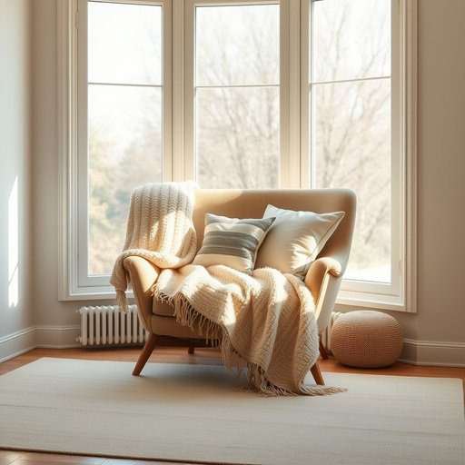

# chaise

<h1 style="font-size: 2.5em; font-weight: 300; letter-spacing: 2px; margin: 0; color: #2c3e50;">
/ʃeɪz/
</h1>

---

---

## 例句

After a long day tidying up the living room and rearranging the furniture to create a more inviting space, Sarah finally sank into the worn, yet surprisingly comfortable, chaise by the bay window, which, bathed in the soft afternoon light and adorned with a plush throw and several mismatched cushions, had become her favourite spot for reading and unwinding.

*After(/ˈæftər/) a(/ə/) long(/lɔŋ/) day(/deɪ/) tidying(/tidying*/) up(/əp/) the(/ðə/) living(/ˈlɪvɪŋ/) room(/rum/) and(/ənd/) rearranging(/ˌriərˈeɪnʤɪŋ/) the(/ðə/) furniture(/ˈfərnɪʧər/) to(/tɪ/) create(/kriˈeɪt/) a(/ə/) more(/mɔr/) inviting(/ˌɪnˈvaɪtɪŋ/) space,(/speɪs,/) Sarah(/ˈsɛrə/) finally(/ˈfaɪnəli/) sank(/sæŋk/) into(/ˈɪntu/) the(/ðə/) worn,(/wɔrn,/) yet(/jɛt/) surprisingly(/səˈpraɪzɪŋli/) comfortable,(/ˈkəmfərtəbəl,/) chaise(/ʃeɪz/) by(/baɪ/) the(/ðə/) bay(/beɪ/) window,(/ˈwɪndoʊ,/) which,(/wɪʧ,/) bathed(/beɪðd/) in(/ɪn/) the(/ðə/) soft(/sɔft/) afternoon(/ˌæftərˈnun/) light(/laɪt/) and(/ənd/) adorned(/əˈdɔrnd/) with(/wɪθ/) a(/ə/) plush(/pləʃ/) throw(/θroʊ/) and(/ənd/) several(/ˈsɛvərəl/) mismatched(/mɪsˈmæʧt/) cushions,(/ˈkʊʃənz,/) had(/hæd/) become(/bɪˈkəm/) her(/hər/) favourite(/ˈfeɪvərɪt/) spot(/spɑt/) for(/fər/) reading(/ˈrɛdɪŋ/) and(/ənd/) unwinding.(/ənˈwaɪndɪŋ./)*

**翻译：** 忙碌了一整天，莎拉整理了客厅并重新摆放家具，营造出一个更加温馨的空间后，终于沉入那张靠近飘窗的旧长沙发。柔和的午后阳光洒落其上，搭配绒质毯子和几只风格各异的靠垫，使这里成为她最喜欢的阅读和放松之地。

---

## 解释

英语单词“chaise”作为名词在家居生活用品语境中，指的是一种带长靠背的休闲椅，通常设计用来使人半躺或伸展身体，类似于“躺椅”或“贵妃椅”，常见于客厅、阳台或花园等休闲场所。使用时，多见于诸如“chaise lounge”或“chaise longue”这样的短语中，虽有时单独使用“chaise”，但“chaise longue”更为正式且普遍，意指加长的休闲椅。英语学习者需要注意的是，“chaise”作为可数名词，前面通常需要冠词，不可直接用作复数形式，且与“lounge”搭配时发音和拼写有时会产生混淆，建议记忆完整短语。该词源自法语，意为“椅子”，其根源可追溯到拉丁语“cathedra”，原指坐具，传入英语时带有贵族和舒适的生活方式象征。在中文语境中，“chaise”准确翻译为“（贵妃）躺椅”或“长椅”，强调其供人体半躺休息的特点，无明显褒贬色彩，但因其设计多与优雅和时尚联系，具有一定的文化品味象征。整体而言，“chaise”在家居用语中更多体现的是一种舒适与休闲的家具类型，适用语境较为正式且带有装饰性功能，不建议随意泛用以免引起误解。

---

<small style="color: #999; font-size: 0.9em;">2025-07-17 06:22:39</small>

