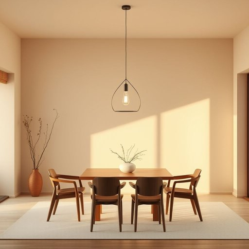

# chandelier

<h1 style="font-size: 2.5em; font-weight: 300; letter-spacing: 2px; margin: 0; color: #2c3e50;">
/ʃændəˈlɪr/
</h1>

---

---

## 例句

Although the chandelier in the dining room was originally an extravagant antique, its delicate crystal droplets refracting the evening light create such a warm and inviting atmosphere that it has become the centerpiece of our family gatherings and a frequent topic of admiration among our guests.

*Although(/ˌɔlˈðoʊ/) the(/ðə/) chandelier(/ʃændəˈlɪr/) in(/ɪn/) the(/ðə/) dining(/ˈdaɪnɪŋ/) room(/rum/) was(/wɑz/) originally(/ərˈɪʤənəli/) an(/ən/) extravagant(/ɛkˈstrævəgənt/) antique,(/ænˈtik,/) its(/ɪts/) delicate(/ˈdɛləkət/) crystal(/ˈkrɪstəl/) droplets(/ˈdrɑpləts/) refracting(/refracting*/) the(/ðə/) evening(/ˈivnɪŋ/) light(/laɪt/) create(/kriˈeɪt/) such(/səʧ/) a(/ə/) warm(/wɔrm/) and(/ənd/) inviting(/ˌɪnˈvaɪtɪŋ/) atmosphere(/ˈætməsˌfɪr/) that(/ðət/) it(/ɪt/) has(/həz/) become(/bɪˈkəm/) the(/ðə/) centerpiece(/ˈsɛntərˌpis/) of(/əv/) our(/ɑr/) family(/ˈfæməli/) gatherings(/ˈgæðərɪŋz/) and(/ənd/) a(/ə/) frequent(/ˈfrikˌwɛnt/) topic(/ˈtɑpɪk/) of(/əv/) admiration(/ˌædmərˈeɪʃən/) among(/əˈməŋ/) our(/ɑr/) guests.(/gɛsts./)*

**翻译：** 虽然餐厅的吊灯最初是一件奢华的古董，但其精致的水晶滴在晚霞中折射出的光芒营造出温馨宜人的氛围，因而成为我们家庭聚会的焦点，也常常成为宾客们赞叹的话题。

---

## 解释

单词“chandelier”作为名词在家居生活用品场景中指的是悬挂于天花板上的大型装饰性吊灯，通常由金属框架和多个灯泡、烛台或水晶灯饰组成，用于照明和美化室内空间，常见于客厅、餐厅或宴会厅等正式场合。英语学习者需要注意，“chandelier”是可数名词，复数形式为“chandeliers”，且通常与动词“hang”（挂）、“install”（安装）、“decorate”（装饰）等搭配使用，如“hang a chandelier”（挂吊灯）、“install a crystal chandelier”（安装水晶吊灯）。此外，常见表达还有“antique chandelier”（古董吊灯）、“luxurious chandelier”（豪华吊灯）等，能够增添语言的细节描写。词源来自法语“chandelle”（蜡烛）和后缀“-ier”，最初指悬挂多支蜡烛的灯具，随着电灯普及演化为现代的装饰吊灯。中文语境中“chandelier”准确译为“吊灯”或“枝形吊灯”，强调其挂于顶棚且通常造型华丽的特点，不包含褒贬意义，但因其价格和设计多偏向高档，常带有豪华、典雅的文化色彩，象征精致和品味。因此，理解“chandelier”不仅是家居照明用品，更关联审美和身份象征，使用时注意其正式且装饰性的语义。

---

<small style="color: #999; font-size: 0.9em;">2025-07-17 06:22:39</small>

