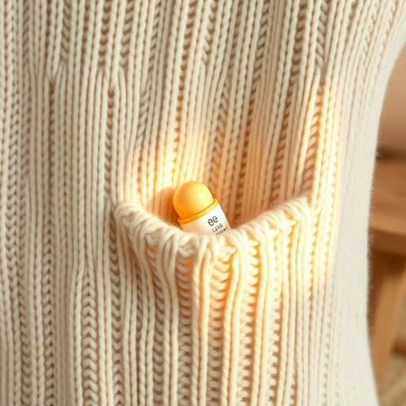

# chapstick

<h1 style="font-size: 2.5em; font-weight: 300; letter-spacing: 2px; margin: 0; color: #2c3e50;">
/chapstick*/
</h1>

---

---

## 例句

Whenever you find your lips cracking during the cold winter months, it’s always wise to keep a lip balm, such as chapstick, on the bedside table or tucked inside your favourite knitted jumper pocket, so that you can immediately soothe the dryness without having to interrupt your evening routine.

*Whenever(/wɛˈnɛvər/) you(/ju/) find(/faɪnd/) your(/jʊr/) lips(/lɪps/) cracking(/ˈkrækɪŋ/) during(/ˈdʊrɪŋ/) the(/ðə/) cold(/koʊld/) winter(/ˈwɪntər/) months,(/mənθs,/) it’s(/it’s*/) always(/ˈɔlˌweɪz/) wise(/waɪz/) to(/tɪ/) keep(/kip/) a(/ə/) lip(/lɪp/) balm,(/bɑm,/) such(/səʧ/) as(/ɛz/) chapstick,(/chapstick*,/) on(/ɔn/) the(/ðə/) bedside(/ˈbɛdˌsaɪd/) table(/ˈteɪbəl/) or(/ər/) tucked(/təkt/) inside(/ˌɪnˈsaɪd/) your(/jʊr/) favourite(/ˈfeɪvərɪt/) knitted(/ˈnɪtɪd/) jumper(/ˈʤəmpər/) pocket,(/ˈpɑkət,/) so(/soʊ/) that(/ðət/) you(/ju/) can(/kən/) immediately(/ˌɪˈmiˌdiətli/) soothe(/suð/) the(/ðə/) dryness(/ˈdraɪnəs/) without(/wɪˈθaʊt/) having(/ˈhævɪŋ/) to(/tɪ/) interrupt(/ˌɪntərˈəpt/) your(/jʊr/) evening(/ˈivnɪŋ/) routine.(/ruˈtin./)*

**翻译：** 每当你在寒冷的冬季发现嘴唇干裂时，最好在床头柜上放一支润唇膏，或塞进你最喜欢的针织毛衣口袋里，这样就能立即缓解干燥，不必打断晚间的生活节奏。

---

## 解释

“chapstick”作为名词，主要指一种用于保护和滋润嘴唇的唇膏，通常以小圆筒形状出现，便于携带和涂抹，常见于家居生活用品中。具体使用场合多见于日常护肤情境，如冬季干燥天气为了防止嘴唇干裂而涂抹“chapstick”，或者在户外活动中对抗风吹日晒时使用。英语学习者需要注意，“chapstick”在语法上多用作不可数名词表示唇膏这一类产品，但在口语中也可用作可数名词指某一具体品牌或一支唇膏，其常见搭配有“apply chapstick”（涂抹唇膏）、“put on chapstick”（擦嘴唇膏）等，表达时通常不加冠词或加不定冠词“a”，需根据具体语境判断。词源方面，“chapstick”是品牌名称的泛化，最初由美国公司于20世纪中叶推出的同名唇膏产品，其命名结合了“chap”（意指裂开、干裂，常用于形容皮肤干裂）和“stick”（棒状物），形象地描述了用于防止嘴唇干裂的棒状护唇膏。中文中“chapstick”通常译为“唇膏”或“润唇膏”，强调其保护和滋润嘴唇的功能，且区别于彩妆用途的口红。该词在中文语境中无褒贬含义，属于中性词汇，反映日常生活中的实用品，但需注意其多为护肤性质的产品而非化妆品，避免混淆。总体来看，“chapstick”是一种常见且具体的生活护理用具词汇，其用法简单且易于理解，适合描写日常生活中的护唇行为。

---

<small style="color: #999; font-size: 0.9em;">2025-07-17 06:22:39</small>

