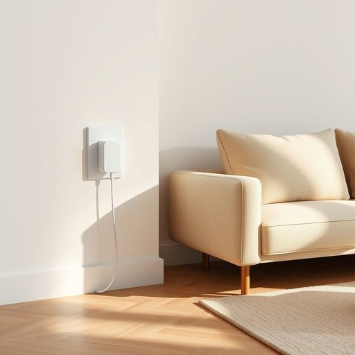

# charger

<h1 style="font-size: 2.5em; font-weight: 300; letter-spacing: 2px; margin: 0; color: #2c3e50;">
/ˈʧɑrʤər/
</h1>

---

---

## 例句

Could you please pass me the charger that’s plugged into the living room socket next to the sofa, the one with the tangled cable, because my phone’s about to die and I need to finish sending these emails before dinner?

*Could(/kʊd/) you(/ju/) please(/pliz/) pass(/pæs/) me(/mi/) the(/ðə/) charger(/ˈʧɑrʤər/) that’s(/that’s*/) plugged(/pləgd/) into(/ˈɪntu/) the(/ðə/) living(/ˈlɪvɪŋ/) room(/rum/) socket(/ˈsɑkət/) next(/nɛkst/) to(/tɪ/) the(/ðə/) sofa,(/ˈsoʊfə,/) the(/ðə/) one(/wən/) with(/wɪθ/) the(/ðə/) tangled(/ˈtæŋgəld/) cable,(/ˈkeɪbəl,/) because(/bɪˈkəz/) my(/maɪ/) phone’s(/phone’s*/) about(/əˈbaʊt/) to(/tɪ/) die(/daɪ/) and(/ənd/) I(/aɪ/) need(/nid/) to(/tɪ/) finish(/ˈfɪnɪʃ/) sending(/ˈsɛndɪŋ/) these(/ðiz/) emails(/iˈmeɪlz/) before(/ˌbiˈfɔr/) dinner?(/ˈdɪnər?/)*

**翻译：** 你能把插在客厅沙发旁边插座上，那根缠绕着的充电器递给我吗？我的手机快没电了，需要在晚饭前把这些邮件发完。

---

## 解释

英语单词“charger”在家居生活用品领域作为名词，主要指用于给电子设备如手机、平板电脑、笔记本电脑、充电宝等提供电力补充的装置，即“充电器”。具体使用场合多见于日常生活中对这些设备的维护和使用场景，例如“phone charger”（手机充电器），“laptop charger”（笔记本充电器）等，多数情况下指连接电源与设备之间的桥梁。英语学习者在使用该词时需注意其可数形式，通常强调具体的充电装置；常见搭配有“usb charger”（USB充电器）、“wireless charger”（无线充电器）、“fast charger”（快速充电器）等，使用时强调所充设备或充电方式；语法上“charger”作为名词，可与形容词、名词所有格等搭配，且在复数形式为“chargers”。词源上，“charger”来自中古英语，最初含义多与“载物的东西”有关，后来引申为“装载电力的设备”，体现功能变化。中文语境中，准确翻译为“充电器”，是日常生活中非常常见和实用的电子辅助用品，该词无特别褒贬含义，但由于现代人对电子设备依赖，谈及“charger”时往往带有“必需品”的文化意味，体现科技生活的普及和便捷。因此，理解“charger”时应结合具体设备和使用场合，区分设备类别及充电技术，以便更准确传达含义。

---

<small style="color: #999; font-size: 0.9em;">2025-07-17 06:22:39</small>

