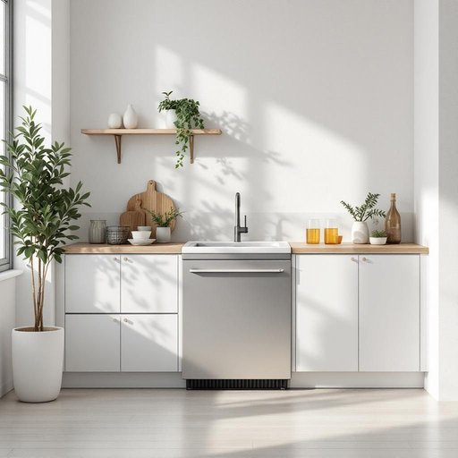

# chiller

<h1 style="font-size: 2.5em; font-weight: 300; letter-spacing: 2px; margin: 0; color: #2c3e50;">
/ˈʧɪlər/
</h1>

---

---

## 例句

Before we start the party, could you please check if the chiller in the kitchen is working properly, since it's the only appliance capable of keeping all the drinks perfectly cold throughout the evening, which is absolutely essential given how hot it’s supposed to get later?

*Before(/ˌbiˈfɔr/) we(/wi/) start(/stɑrt/) the(/ðə/) party,(/ˈpɑrti,/) could(/kʊd/) you(/ju/) please(/pliz/) check(/ʧɛk/) if(/ɪf/) the(/ðə/) chiller(/ˈʧɪlər/) in(/ɪn/) the(/ðə/) kitchen(/ˈkɪʧən/) is(/ɪz/) working(/ˈwərkɪŋ/) properly,(/ˈprɑpərli,/) since(/sɪns/) it's(/ɪts/) the(/ðə/) only(/ˈoʊnli/) appliance(/əˈplaɪəns/) capable(/ˈkeɪpəbəl/) of(/əv/) keeping(/ˈkipɪŋ/) all(/ɔl/) the(/ðə/) drinks(/drɪŋks/) perfectly(/ˈpərfəktli/) cold(/koʊld/) throughout(/θruaʊt/) the(/ðə/) evening,(/ˈivnɪŋ,/) which(/wɪʧ/) is(/ɪz/) absolutely(/ˌæbsəˈlutli/) essential(/ɛˈsɛnʃəl/) given(/ˈgɪvɪn/) how(/haʊ/) hot(/hɑt/) it’s(/it’s*/) supposed(/səˈpoʊzd/) to(/tɪ/) get(/gɪt/) later?(/ˈleɪtər?/)*

**翻译：** 在派对开始之前，能否请你检查一下厨房的冷水机是否正常运转？因为它是唯一能够整晚保持所有饮品冰镇的设备，而鉴于天气预报说待会儿会非常炎热，这一点尤为重要。

---

## 解释

英语单词“chiller”在家居生活用品领域作为名词，通常指用于制冷或冷却的设备，例如家用冷水机组、小型饮料冷藏器或者冷冻装置，常见于厨房、地下室或家用中央空调系统中，用以降低温度或保存食品。具体使用场合多为描述家庭制冷设备或家用冷藏设施的技术参数和功能说明，如“The chiller keeps the beverages cold”表示“冷却器保持饮料冷却”。学习者在使用“chiller”时需注意该词为可数名词，复数形式为“chillers”，且常与表示冷却、制冷的动词如“operate”，“install”搭配，常见表达包括“water chiller”（水冷机），或“air chiller”（空气冷却器）。该词源自英文“chill”动词，意为“使变冷”，加上表示“器具”的后缀“-er”，合成名词表示“降温器具”，其词根来源于古英语“ceil”，与冷有关的词汇家族有亲缘关系。在中文语境中，“chiller”通常译为“冷水机”、“制冷机”或“冷却器”，根据具体设备功能而定，强调其在环保节能或家居舒适系统中的作用。无明显褒贬色彩或文化内涵，更多呈现为技术性、功能性词汇，适用于产品介绍、安装指南等正式语境。

---

<small style="color: #999; font-size: 0.9em;">2025-07-17 06:22:39</small>

