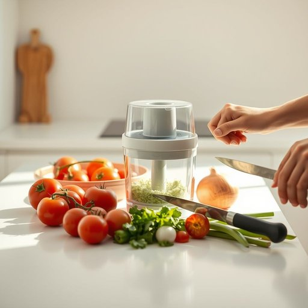

# chopper

<h1 style="font-size: 2.5em; font-weight: 300; letter-spacing: 2px; margin: 0; color: #2c3e50;">
/ˈʧɑpər/
</h1>

---

---

## 例句

I was trying to prepare a fresh salsa for tonight’s dinner party, but unfortunately, the electric chopper, which I had bought last month because of its supposed efficiency and compact design, broke down halfway through chopping the tomatoes and onions, leaving me to hack away manually with a knife while keeping an eye on the oven.

*I(/aɪ/) was(/wɑz/) trying(/traɪɪŋ/) to(/tɪ/) prepare(/priˈpɛr/) a(/ə/) fresh(/frɛʃ/) salsa(/ˈsɑlsə/) for(/fər/) tonight’s(/tonight’s*/) dinner(/ˈdɪnər/) party,(/ˈpɑrti,/) but(/bət/) unfortunately,(/ənˈfɔrʧənətli,/) the(/ðə/) electric(/ɪˈlɛktrɪk/) chopper,(/ˈʧɑpər,/) which(/wɪʧ/) I(/aɪ/) had(/hæd/) bought(/bɔt/) last(/læst/) month(/mənθ/) because(/bɪˈkəz/) of(/əv/) its(/ɪts/) supposed(/səˈpoʊzd/) efficiency(/ɪˈfɪʃənsi/) and(/ənd/) compact(/ˈkɑmpækt/) design,(/dɪˈzaɪn,/) broke(/broʊk/) down(/daʊn/) halfway(/ˈhæfˈweɪ/) through(/θru/) chopping(/ˈʧɑpɪŋ/) the(/ðə/) tomatoes(/təˈmɑtoʊz/) and(/ənd/) onions,(/ˈənjənz,/) leaving(/ˈlivɪŋ/) me(/mi/) to(/tɪ/) hack(/hæk/) away(/əˈweɪ/) manually(/ˈmænjuəli/) with(/wɪθ/) a(/ə/) knife(/naɪf/) while(/waɪl/) keeping(/ˈkipɪŋ/) an(/ən/) eye(/aɪ/) on(/ɔn/) the(/ðə/) oven.(/ˈəvən./)*

**翻译：** 我正准备今晚聚会的新鲜莎莎酱，然而那台我上个月因其高效和紧凑设计而购买的电动切菜机，在切番茄和洋葱时突然坏了，只能一边盯着烤箱，一边用刀手动切菜。

---

## 解释

英语单词chopper在家居生活用品场景中作为名词，通常指的是切菜机、剁碎机或食品料理机，专门用于快速切碎、剁碎蔬菜、坚果、肉类等食材，便于烹饪准备，具体使用场合多见于厨房，特别是在准备沙拉、酱料或者需要细碎食材时，英语学习者使用该词时需注意，chopper在此语境中通常作可数名词，表示具体的厨房电器或手动工具，常用搭配如food chopper（食品切碎机）、vegetable chopper（蔬菜剁碎机），以及与动词use、buy、clean连用，表达操作或购买行为，语法上通常作为名词使用，不直接与动词连用，亦无复数特殊形式，词源方面，chopper源自动词chop（砍、剁），加上表示物品的后缀-er，原意指用来砍的工具，延伸至厨房电器时多指剁碎功能的小型器具，在中文语境下，chopper准确翻译为切菜机或剁碎机，强调其辅助厨房食材加工的功能，无明显褒贬色彩，属于中性词汇，但在口语或非正式场合可能泛指任何可用于快速切碎食物的工具或机器，需要注意的是，chopper在其他语境中还可指直升机或砍刀等，但在家庭厨房用品中理解为切碎器具最为贴切，使用时避免混淆。

---

<small style="color: #999; font-size: 0.9em;">2025-07-17 06:22:39</small>

