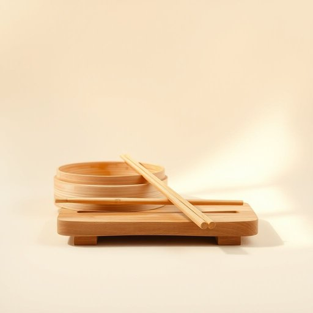

# chopstick

<h1 style="font-size: 2.5em; font-weight: 300; letter-spacing: 2px; margin: 0; color: #2c3e50;">
/ˈʧɑpˌstɪk/
</h1>

---

---

## 例句

After rummaging through the cluttered drawer filled with various utensils, the chopstick I found not only reminded me of the need to buy a proper set but also inspired me to clean all the cutlery thoroughly and invest in a nice holder to keep them organized next to the bamboo steamer we brought back from our trip to Chinatown last year.

*After(/ˈæftər/) rummaging(/ˈrəmɪʤɪŋ/) through(/θru/) the(/ðə/) cluttered(/ˈklətərd/) drawer(/drɔr/) filled(/fɪld/) with(/wɪθ/) various(/ˈvɛriəs/) utensils,(/juˈtɛnsəlz,/) the(/ðə/) chopstick(/ˈʧɑpˌstɪk/) I(/aɪ/) found(/faʊnd/) not(/nɑt/) only(/ˈoʊnli/) reminded(/riˈmaɪndɪd/) me(/mi/) of(/əv/) the(/ðə/) need(/nid/) to(/tɪ/) buy(/baɪ/) a(/ə/) proper(/ˈprɑpər/) set(/sɛt/) but(/bət/) also(/ˈɔlsoʊ/) inspired(/ˌɪnˈspaɪərd/) me(/mi/) to(/tɪ/) clean(/klin/) all(/ɔl/) the(/ðə/) cutlery(/ˈkətləri/) thoroughly(/ˈθəroʊli/) and(/ənd/) invest(/ˌɪnˈvɛst/) in(/ɪn/) a(/ə/) nice(/nis/) holder(/ˈhoʊldər/) to(/tɪ/) keep(/kip/) them(/ðɛm/) organized(/ˈɔrgəˌnaɪzd/) next(/nɛkst/) to(/tɪ/) the(/ðə/) bamboo(/bæmˈbu/) steamer(/ˈstimər/) we(/wi/) brought(/brɔt/) back(/bæk/) from(/frəm/) our(/ɑr/) trip(/trɪp/) to(/tɪ/) Chinatown(/ˈʧaɪnəˌtaʊn/) last(/læst/) year.(/jɪr./)*

**翻译：** 在翻找那个装满各式餐具的杂乱抽屉时，我找到的筷子不仅让我想起需要购买一套餐具，也激发了我彻底清洁所有餐具，并购置一个精致的筷子架，用来放置在我们去年从华埠带回来的竹制蒸笼旁，便于整齐收纳。

---

## 解释

英语单词“chopstick”作为名词，指的是用于夹取食物的筷子，主要出现在涉及餐饮、家居生活用品或亚洲饮食文化的语境中，如家庭用餐、亚洲餐馆用具描述等场合。学习者在使用该词时需注意单数形式为“chopstick”，复数形式为“chopsticks”，通常以复数形式出现，因为筷子成对使用，且常见搭配有“use chopsticks”（使用筷子）、“hold chopsticks”（拿筷子）、“learn to use chopsticks”（学用筷子），此外，“chopstick rest”（筷子架）等词汇也比较常见。在语法上，“chopsticks”作为可数名词，需要根据数量使用适当冠词或数词，如“一双筷子”(a pair of chopsticks)。该词源自19世纪的英语借用，结合了“chop”（快速、砍切的动作）和“stick”（小棒子），意指一对方便夹取食物的小木棍，其中文名称“筷子”体现了同样的功能和材质特点。在中文语境中，“chopstick”准确翻译为“筷子”，这个词不仅是中华及东亚饮食文化的重要标志，也承载着礼仪与文化习俗，因此在描述时应避免误用或将筷子简单视为西式餐具的一部分。总的来说，“chopstick”是一种中性词汇，没有特别的褒贬含义，但在跨文化交流中，它象征着亚洲饮食文化的独特性和生活习惯。

---

<small style="color: #999; font-size: 0.9em;">2025-07-17 06:22:39</small>

