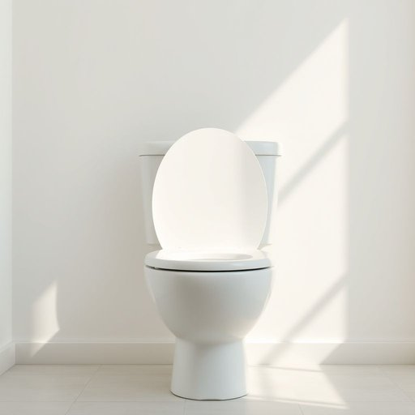

# cistern

<h1 style="font-size: 2.5em; font-weight: 300; letter-spacing: 2px; margin: 0; color: #2c3e50;">
/ˈsɪstərn/
</h1>

---

---

## 例句

Before calling the plumber, I checked the cistern carefully to see if the slow leak was due to a faulty float mechanism or perhaps a cracked seal, as the constant dripping not only wasted water but also caused a persistent, irritating noise throughout the night.

*Before(/ˌbiˈfɔr/) calling(/ˈkɔlɪŋ/) the(/ðə/) plumber,(/ˈpləmər,/) I(/aɪ/) checked(/ʧɛkt/) the(/ðə/) cistern(/ˈsɪstərn/) carefully(/ˈkɛrfəli/) to(/tɪ/) see(/si/) if(/ɪf/) the(/ðə/) slow(/sloʊ/) leak(/lik/) was(/wɑz/) due(/du/) to(/tɪ/) a(/ə/) faulty(/ˈfɔlti/) float(/floʊt/) mechanism(/ˈmɛkəˌnɪzəm/) or(/ər/) perhaps(/pərˈhæps/) a(/ə/) cracked(/krækt/) seal,(/sil,/) as(/ɛz/) the(/ðə/) constant(/ˈkɑnstənt/) dripping(/ˈdrɪpɪŋ/) not(/nɑt/) only(/ˈoʊnli/) wasted(/ˈweɪstɪd/) water(/ˈwɔtər/) but(/bət/) also(/ˈɔlsoʊ/) caused(/kɔzd/) a(/ə/) persistent,(/pərˈsɪstənt,/) irritating(/ˈɪrəˌteɪtɪŋ/) noise(/nɔɪz/) throughout(/θruaʊt/) the(/ðə/) night.(/naɪt./)*

**翻译：** 在打电话请水管工之前，我仔细检查了水箱，想确认缓慢漏水是否由于浮球机构故障或密封圈裂纹引起，因为不断的滴水不仅浪费了水资源，还在整个夜晚造成了持续且令人烦躁的噪音。

---

## 解释

英语单词“cistern”在家居生活用品的语境中作为名词，主要指的是储水槽或蓄水箱，尤其是厕所的水箱，用来储存冲洗用水。它常见于描述浴室设备，或者老式房屋中储存雨水或供水设施。使用时一般与“toilet cistern”（马桶水箱）搭配较多，也可以用于描述建筑中的储水装置，常用表达如“flush the cistern”（冲洗水箱）或“leaking cistern”（漏水的蓄水箱）。语法上，“cistern”为可数名词，单复数形式分别为“cistern”和“cisterns”，通常不用复数表达时，指代一般意义上的水箱。学习者应注意不要与“sink”（水槽）、“tank”（油箱或大型储水箱）混淆，且“cistern”多指较小或特定用途的储水容器。该词源自拉丁语“cisterna”，意为地下蓄水池，传入英语后用于指家居或建筑中专门存储水的设备。中文语境中，cistern通常翻译为“蓄水箱”或“水箱”，在家庭环境中尤指“马桶水箱”，理解时应结合具体情境，不宜泛指所有储水装置。该词本身无褒贬色彩，也不会带有特殊文化内涵，更多是功能性且中性用词。

---

<small style="color: #999; font-size: 0.9em;">2025-07-17 06:22:39</small>

