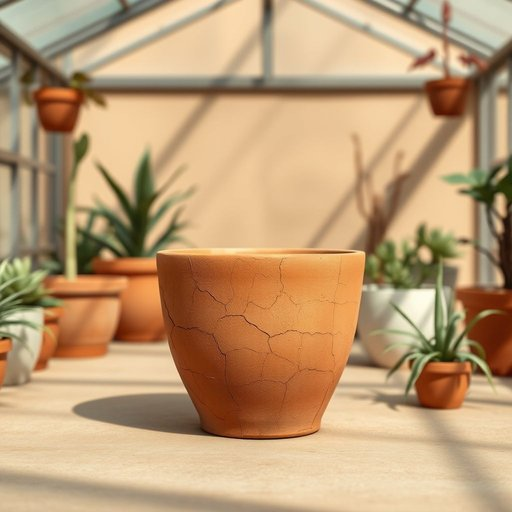

# clay

<h1 style="font-size: 2.5em; font-weight: 300; letter-spacing: 2px; margin: 0; color: #2c3e50;">
/kleɪ/
</h1>

---

---

## 例句

I've been meaning to tell you that the cracked flowerpot in the conservatory, which you admired last weekend, is actually made from a type of clay that, despite its delicate appearance, is remarkably durable and perfect for indoor plants that require good drainage.

*I've(/aɪv/) been(/bɪn/) meaning(/ˈminɪŋ/) to(/tɪ/) tell(/tɛl/) you(/ju/) that(/ðət/) the(/ðə/) cracked(/krækt/) flowerpot(/ˈflaʊərˌpɑt/) in(/ɪn/) the(/ðə/) conservatory,(/kənˈsərvətɔri,/) which(/wɪʧ/) you(/ju/) admired(/ədˈmaɪərd/) last(/læst/) weekend,(/ˈwiˌkɪnd,/) is(/ɪz/) actually(/ˈæˌkʧuəli/) made(/meɪd/) from(/frəm/) a(/ə/) type(/taɪp/) of(/əv/) clay(/kleɪ/) that,(/ðət,/) despite(/dɪˈspaɪt/) its(/ɪts/) delicate(/ˈdɛləkət/) appearance,(/əˈpɪrəns,/) is(/ɪz/) remarkably(/rɪˈmɑrkəbli/) durable(/ˈdʊrəbəl/) and(/ənd/) perfect(/ˈpərˌfɪkt/) for(/fər/) indoor(/ˈɪnˌdɔr/) plants(/plænts/) that(/ðət/) require(/ˌrikˈwaɪər/) good(/gʊd/) drainage.(/ˈdreɪnɪʤ./)*

**翻译：** 我一直想告诉你，上周末你在温室里欣赏的那个有裂纹的花盆，实际上是用一种黏土制成的。尽管它外观细腻，但却非常坚固，非常适合需要良好排水的室内植物。

---

## 解释

英语单词“clay”作为名词在家居生活用品场景中主要指“黏土”或“陶土”，是一种天然的细粒土壤，常用于制作陶器、陶瓷制品、工艺品以及儿童手工材料等。在具体使用场合中，“clay”通常出现在描述陶艺制作、儿童美术课、园艺改良土壤或家居装饰材料时，比如“pottery made from clay”（用黏土制成的陶器）或“modeling clay for kids”（儿童用塑形黏土）。英语学习者在使用“clay”时要注意其作为不可数名词时指代黏土总称，而作为可数名词时可指一块黏土或某种类型的黏土，如“a clay from this region”。常见搭配包括“clay pot”（陶罐）、“clay sculpture”（黏土雕塑）、“clay soil”（黏土土壤）等，表达时需注意区分“clay”与“mud”等词的细微差别，前者更偏向于自然形成且具有塑性特色的土壤成分。该词来源于古英语“clæg”，与德语“Lehm”和荷兰语“klei”同源，反映了其作为自然界常见材料的基本属性。在中文语境中，“clay”准确翻译为“黏土”，强调其细腻且具可塑性的天然矿物质，用于陶艺和园艺中，通常无褒贬含义，但在文化层面，黏土也象征着朴实与创造力。综上，“clay”在家居生活用品领域的使用侧重于材料性质及其工艺应用，语义中性且具实用价值，需根据上下文正确理解和搭配运用。

---

<small style="color: #999; font-size: 0.9em;">2025-07-17 06:22:39</small>

