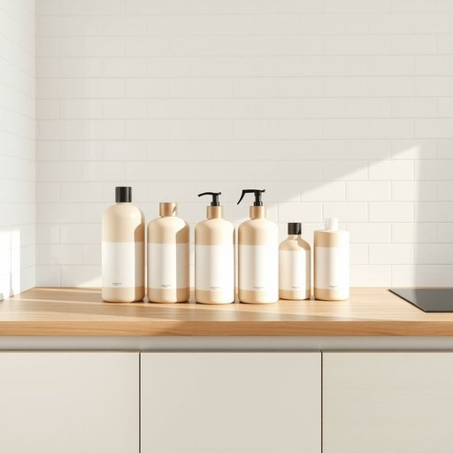

# cleaner

<h1 style="font-size: 2.5em; font-weight: 300; letter-spacing: 2px; margin: 0; color: #2c3e50;">
/ˈklinər/
</h1>

---

---

## 例句

Before we start the spring cleaning, could you please check if the cleaner we bought last month, which is advertised as both eco-friendly and safe for wooden surfaces, is suitable for the kitchen countertops as well as the bathroom tiles?

*Before(/ˌbiˈfɔr/) we(/wi/) start(/stɑrt/) the(/ðə/) spring(/spərɪŋ/) cleaning,(/ˈklinɪŋ,/) could(/kʊd/) you(/ju/) please(/pliz/) check(/ʧɛk/) if(/ɪf/) the(/ðə/) cleaner(/ˈklinər/) we(/wi/) bought(/bɔt/) last(/læst/) month,(/mənθ,/) which(/wɪʧ/) is(/ɪz/) advertised(/ˌædvərˈtaɪzd/) as(/ɛz/) both(/boʊθ/) eco-friendly(/eco-friendly*/) and(/ənd/) safe(/seɪf/) for(/fər/) wooden(/ˈwʊdən/) surfaces,(/ˈsərfəsɪz,/) is(/ɪz/) suitable(/ˈsutəbəl/) for(/fər/) the(/ðə/) kitchen(/ˈkɪʧən/) countertops(/ˈkaʊntərˌtɑps/) as(/ɛz/) well(/wɛl/) as(/ɛz/) the(/ðə/) bathroom(/ˈbæθˌrum/) tiles?(/taɪlz?/)*

**翻译：** 在我们开始春季大扫除之前，能否请你确认一下我们上个月购买的那款清洁剂——宣传称既环保又安全适用于木质表面——是否也适合用来清洁厨房台面和浴室瓷砖？

---

## 解释

英语单词“cleaner”作为名词，在家居生活用品的语境中主要指用于清洁的物品或化学制剂，如地板清洁剂、玻璃清洁液、衣物清洁剂等，通常用于去除污渍、灰尘或细菌。使用时常见搭配包括“window cleaner”（玻璃清洁剂）、“carpet cleaner”（地毯清洁剂）、“floor cleaner”（地板清洁剂）等，学习者应注意其不可数和可数名词的区别，比如“a cleaner”可指一瓶清洁剂，而“cleaner”泛指清洁剂的种类或用途。此外，“cleaner”也可指聘请的打扫人员，但在家居用品语境下通常不包含此义。语法上，“cleaner”作为可数名词，可直接作主语或宾语，且常与形容词连用，如“effective cleaner”（有效的清洁剂）。词源上，“cleaner”由动词“clean”加上表示施动者或物品的后缀“-er”构成，字面含义为“使干净的东西或人”，该词形成于19世纪，随着家庭清洁产品的普及而广泛应用。在中文语境中，“cleaner”作为家居清洁用品时应译为“清洁剂”或“清洁用品”，强调其用途为帮助清洁，而非指清洁工人，避免混淆。该词在使用时无特别褒贬色彩，属于中性词汇，但应根据语境判断是指清洁剂还是打扫人员。理解和运用时，应结合具体的家居用品类别及用途，准确把握其名词属性和搭配习惯。

---

<small style="color: #999; font-size: 0.9em;">2025-07-17 06:22:39</small>

