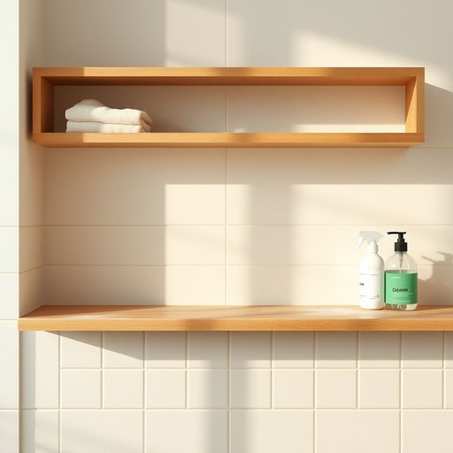

# cleaning

<h1 style="font-size: 2.5em; font-weight: 300; letter-spacing: 2px; margin: 0; color: #2c3e50;">
/ˈklinɪŋ/
</h1>

---

---

## 例句

After the spring cleaning was completed, which included scrubbing the kitchen tiles and dusting the shelves, the cleaning not only improved the appearance of the house but also demonstrated that using eco-friendly cleaning products benefits both the environment and the people living there.

*After(/ˈæftər/) the(/ðə/) spring(/spərɪŋ/) cleaning(/ˈklinɪŋ/) was(/wɑz/) completed,(/kəmˈplitɪd,/) which(/wɪʧ/) included(/ˌɪnˈkludɪd/) scrubbing(/ˈskrəbɪŋ/) the(/ðə/) kitchen(/ˈkɪʧən/) tiles(/taɪlz/) and(/ənd/) dusting(/ˈdəstɪŋ/) the(/ðə/) shelves,(/ʃɛlvz,/) the(/ðə/) cleaning(/ˈklinɪŋ/) not(/nɑt/) only(/ˈoʊnli/) improved(/ˌɪmˈpruvd/) the(/ðə/) appearance(/əˈpɪrəns/) of(/əv/) the(/ðə/) house(/haʊs/) but(/bət/) also(/ˈɔlsoʊ/) demonstrated(/ˈdɛmənˌstreɪtɪd/) that(/ðət/) using(/ˈjuzɪŋ/) eco-friendly(/eco-friendly*/) cleaning(/ˈklinɪŋ/) products(/ˈprɑdəkts/) benefits(/ˈbɛnəfɪts/) both(/boʊθ/) the(/ðə/) environment(/ɪnˈvaɪrənmənt/) and(/ənd/) the(/ðə/) people(/ˈpipəl/) living(/ˈlɪvɪŋ/) there.(/ðɛr./)*

**翻译：** 春季大扫除完成后，除了擦洗了厨房的瓷砖和掸拭了书架，清洁工作不仅改善了房屋的外观，还证明了使用环保清洁产品有益于环境和居住者。

---

## 解释

英语单词“cleaning”在家居生活用品场景中作为名词使用时，主要指“清洁工作”或“清扫活动”，即对家居环境如地板、家具、窗户等进行打扫、擦拭和整理的动作或过程。具体使用场合通常包括谈论打扫卫生的任务、日常维护家居的清洁工作，或形容某次清理活动，例如“do the cleaning”（做清洁工作）、“cleaning supplies”（清洁用品）、“spring cleaning”（春季大扫除）等。在语法上，“cleaning”作为名词属于动名词形式，通常用作不可数名词，但在特定上下文中可指具体的一次清洁活动而复数化，如“the cleanings at the office”（办公室的清洁工作）。学习者需注意“cleaning”本身不指具体的清洁工具，而是清洁的行为或过程，与之搭配使用的词语通常是“supplies”（用品）、“service”（服务）、“product”（产品）等。词源方面，“cleaning”来源于动词“clean”的现在分词形式，“clean”源自古英语“clǣne”，意为“干净、纯净”，随着语义的发展衍生出表示清洁活动的名词形式。在中文语境中，“cleaning”一般准确翻译为“清洁”或“打扫”，侧重指动作和过程，而非具体物品，使用时需根据上下文调整，例如“cleaning services”翻译为“清洁服务”，“cleaning products”为“清洁用品”。该词本身无褒贬色彩，属于中性词，文化内涵较为直接，与家庭卫生、生活质量紧密相关，体现了对居住环境整洁的关注与重视。

---

<small style="color: #999; font-size: 0.9em;">2025-07-17 06:22:39</small>

