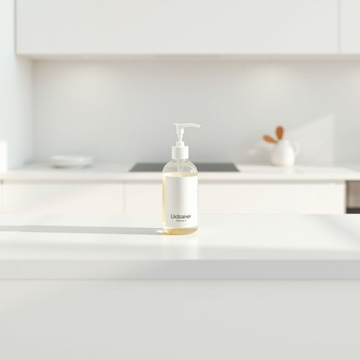

# cleanser

<h1 style="font-size: 2.5em; font-weight: 300; letter-spacing: 2px; margin: 0; color: #2c3e50;">
/ˈklɛnzər/
</h1>

---

---

## 例句

Before you start scrubbing the kitchen counters, make sure to grab the gentle cleanser I bought last week, which not only removes stubborn grease effectively but also leaves a fresh scent without any harsh chemicals that might irritate your skin.

*Before(/ˌbiˈfɔr/) you(/ju/) start(/stɑrt/) scrubbing(/ˈskrəbɪŋ/) the(/ðə/) kitchen(/ˈkɪʧən/) counters,(/ˈkaʊntərz,/) make(/meɪk/) sure(/ʃʊr/) to(/tɪ/) grab(/græb/) the(/ðə/) gentle(/ˈʤɛnəl/) cleanser(/ˈklɛnzər/) I(/aɪ/) bought(/bɔt/) last(/læst/) week,(/wik,/) which(/wɪʧ/) not(/nɑt/) only(/ˈoʊnli/) removes(/riˈmuvz/) stubborn(/ˈstəbərn/) grease(/gris/) effectively(/ˈifɛktɪvli/) but(/bət/) also(/ˈɔlsoʊ/) leaves(/livz/) a(/ə/) fresh(/frɛʃ/) scent(/sɛnt/) without(/wɪˈθaʊt/) any(/ˈɛni/) harsh(/hɑrʃ/) chemicals(/ˈkɛmɪkəlz/) that(/ðət/) might(/maɪt/) irritate(/ˈɪrɪˌteɪt/) your(/jʊr/) skin.(/skɪn./)*

**翻译：** 在开始擦洗厨房台面之前，务必先拿我上周买的温和清洁剂，它不仅能有效去除顽固油渍，还能留下清新香气，而且不含任何可能刺激皮肤的刺激性化学成分。

---

## 解释

英语单词cleanser作为名词在家居生活用品的语境中通常指用来清洁的产品尤其是面部或皮肤清洁用品如洗面奶洁面乳等也可以泛指各种清洁剂如厨房清洁剂家具清洁剂等使用时多见于涉及个人护理或家庭清洁的场合例如在描述护肤步骤购买日用品或说明清洁方法时语法上cleanser为可数名词常与限定词连用如a facial cleanser一种面部洁面乳a household cleanser某种家用清洁剂且常见搭配有gentle cleanser温和的洁面产品deep cleanser深层清洁剂等学习者需注意其词性是名词不宜将其误用为动词或形容词在表达技巧上可以通过形容词修饰来具体说明用途和特点词源方面cleanser来源于动词clean清洁加上名词后缀ser用于表示执行清洁动作的工具或产品这种构词方式在英语中较为常见中文语境中cleanser通常翻译为洁面乳洗面奶或清洁剂根据具体语境有所不同需要结合产品类型和用途确定准确翻译在日常生活中多指个人护理类洁面产品偏重温和且适合皮肤使用的含义该词本身无褒贬和特殊文化色彩属于中性词主要强调清洁功能使用时应注意根据不同场合明确具体类型以避免误解

---

<small style="color: #999; font-size: 0.9em;">2025-07-17 06:22:39</small>

