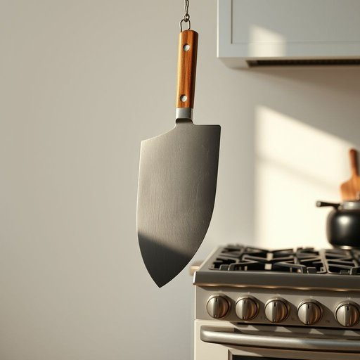

# cleaver

<h1 style="font-size: 2.5em; font-weight: 300; letter-spacing: 2px; margin: 0; color: #2c3e50;">
/ˈklivər/
</h1>

---

---

## 例句

Could you please hand me the cleaver that’s hanging next to the stove, the one with the wooden handle that’s slightly worn from years of chopping through thick joints of meat and tough vegetables, because I need it to quickly but precisely break down this lamb for tonight’s roast?

*Could(/kʊd/) you(/ju/) please(/pliz/) hand(/hænd/) me(/mi/) the(/ðə/) cleaver(/ˈklivər/) that’s(/that’s*/) hanging(/ˈhæŋɪŋ/) next(/nɛkst/) to(/tɪ/) the(/ðə/) stove,(/stoʊv,/) the(/ðə/) one(/wən/) with(/wɪθ/) the(/ðə/) wooden(/ˈwʊdən/) handle(/ˈhændəl/) that’s(/that’s*/) slightly(/sˈlaɪtli/) worn(/wɔrn/) from(/frəm/) years(/jɪrz/) of(/əv/) chopping(/ˈʧɑpɪŋ/) through(/θru/) thick(/θɪk/) joints(/ʤɔɪnts/) of(/əv/) meat(/mit/) and(/ənd/) tough(/təf/) vegetables,(/ˈvɛʤtəbəlz,/) because(/bɪˈkəz/) I(/aɪ/) need(/nid/) it(/ɪt/) to(/tɪ/) quickly(/kˈwɪkli/) but(/bət/) precisely(/prɪˈsaɪsli/) break(/breɪk/) down(/daʊn/) this(/ðɪs/) lamb(/læm/) for(/fər/) tonight’s(/tonight’s*/) roast?(/roʊst?/)*

**翻译：** 你能把挂在炉子旁边那把菜刀递给我吗？就是那把带着木柄、因为多年劈砍厚重肉块和坚韧蔬菜而略显磨损的菜刀，我需要用它来快速且精准地处理今晚烤羊肉所用的羊肉。

---

## 解释

英语单词"cleaver"作为名词在家居生活用品的语境中，指的是一种大型且厚重的厨刀，通常用于切割较硬的食材如骨头、肉块等。具体使用场合多见于厨房，尤其在处理肉类时，因其刀身宽大、锋利且坚固，适合劈砍而非细致切割。英语学习者在使用该词时应注意，"cleaver"为可数名词，常见搭配包括"a meat cleaver"（一把肉刀）、"chef's cleaver"（厨师用的劈刀）等，语法上一般作单数或复数形式出现，复数为"cleavers"；表达时也可与动词"use"、"handle"等搭配，如"use a cleaver"表示使用劈刀。词源方面，"cleaver"源自中古英语"cleven"意为劈开，与古英语"cleofan"（劈开、分开）有关，显示其劈砍的功能特性。中文中，"cleaver"准确翻译为“砍刀”或“劈骨刀”，强调其力度强和适合俩骨劈肉的用途，区别于一般切肉刀或厨刀。在中文语境下，“砍刀”一词比较贴切且具体，通常无褒贬意义，更多呈现工具属性，文化内涵上强调其实用性和专业性，但需注意避免与农用砍刀混淆。整体来看，"cleaver"作为厨房用具名词，体现了其独特的设计和用途，是饮食文化中不可或缺的切割工具之一。

---

<small style="color: #999; font-size: 0.9em;">2025-07-17 06:22:39</small>

