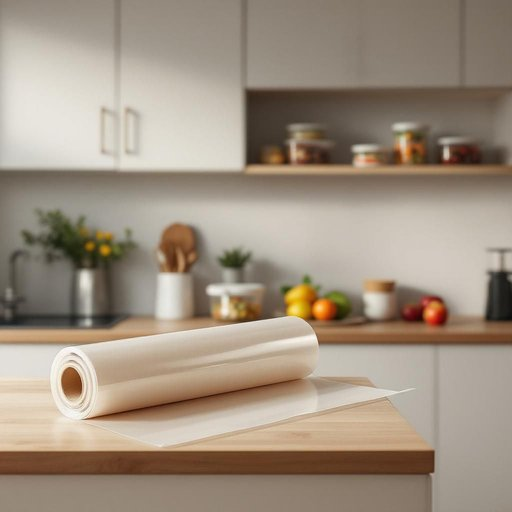

# cling-film

<h1 style="font-size: 2.5em; font-weight: 300; letter-spacing: 2px; margin: 0; color: #2c3e50;">
/cling-film*/
</h1>

---

---

## 例句

Could you please pass me the cling-film from the top shelf in the kitchen cupboard, the one we use to cover leftovers and keep them fresh overnight, especially since the fridge is a bit crowded and we want to avoid any cross-contamination between the different containers?

*Could(/kʊd/) you(/ju/) please(/pliz/) pass(/pæs/) me(/mi/) the(/ðə/) cling-film(/cling-film*/) from(/frəm/) the(/ðə/) top(/tɔp/) shelf(/ʃɛlf/) in(/ɪn/) the(/ðə/) kitchen(/ˈkɪʧən/) cupboard,(/ˈkəbərd,/) the(/ðə/) one(/wən/) we(/wi/) use(/juz/) to(/tɪ/) cover(/ˈkəvər/) leftovers(/ˈlɛfˌtoʊvərz/) and(/ənd/) keep(/kip/) them(/ðɛm/) fresh(/frɛʃ/) overnight,(/ˈoʊvərˈnaɪt,/) especially(/əˈspɛʃəli/) since(/sɪns/) the(/ðə/) fridge(/frɪʤ/) is(/ɪz/) a(/ə/) bit(/bɪt/) crowded(/ˈkraʊdɪd/) and(/ənd/) we(/wi/) want(/wɔnt/) to(/tɪ/) avoid(/əˈvɔɪd/) any(/ˈɛni/) cross-contamination(/cross-contamination*/) between(/bɪtˈwin/) the(/ðə/) different(/ˈdɪfərənt/) containers?(/kənˈteɪnərz?/)*

**翻译：** 你能帮我拿一下厨房橱柜顶层架子上的保鲜膜吗？就是我们用来盖剩饭剩菜、保持食物隔夜新鲜的那种，特别是冰箱有点挤，我们想避免不同容器之间的交叉污染。

---

## 解释

英语单词"cling-film"作为名词，主要指家居生活中常用的保鲜膜或保鲜塑料薄膜，通常用来覆盖食物以保持新鲜、防止串味和污染。这种薄膜多用于厨房储存剩菜、包裹水果蔬菜或密封容器口，其使用场合主要是在家庭厨房、餐厅或食品包装环境。学习者在使用"cling film"时应注意其复合词结构，一般不加复数-s，除非指多种不同类型的保鲜膜，且在书写时通常分为两个单词"cling film"，但英国英语中有时写作"clingfilm"。常见搭配包括"wrap with cling film"（用保鲜膜包裹）、"cover something with cling film"（用保鲜膜覆盖某物）等。词源上，"cling"表示“紧贴、粘附”，而"film"指“薄膜”，合起来形象地描述了这种薄膜能够紧紧贴合物体表面的特性。中文语境中，"cling film"准确翻译为“保鲜膜”，是厨房常用的塑料薄膜制品，无明显褒贬色彩，属于中性词汇。需要注意的是，因文化差异，某些地区可能更多使用“保鲜膜”或“拉鲜膜”等称呼，但意义相同，使用时应根据具体语境选择合适表达。

---

<small style="color: #999; font-size: 0.9em;">2025-07-17 06:22:39</small>

