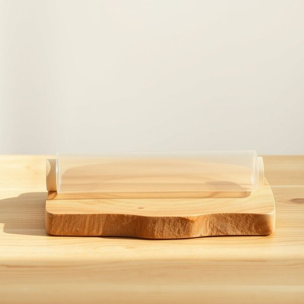

# cling-wrap

<h1 style="font-size: 2.5em; font-weight: 300; letter-spacing: 2px; margin: 0; color: #2c3e50;">
/cling-wrap*/
</h1>

---

---

## 例句

Could you please grab the cling-wrap from the top shelf in the cupboard, the one we usually use to cover leftovers or wrap sandwiches before heading out, especially since it’s the only brand that seals tightly without tearing easily?

*Could(/kʊd/) you(/ju/) please(/pliz/) grab(/græb/) the(/ðə/) cling-wrap(/cling-wrap*/) from(/frəm/) the(/ðə/) top(/tɔp/) shelf(/ʃɛlf/) in(/ɪn/) the(/ðə/) cupboard,(/ˈkəbərd,/) the(/ðə/) one(/wən/) we(/wi/) usually(/ˈjuʒəwəli/) use(/juz/) to(/tɪ/) cover(/ˈkəvər/) leftovers(/ˈlɛfˌtoʊvərz/) or(/ər/) wrap(/ræp/) sandwiches(/ˈsænwɪʧɪz/) before(/ˌbiˈfɔr/) heading(/ˈhɛdɪŋ/) out,(/aʊt,/) especially(/əˈspɛʃəli/) since(/sɪns/) it’s(/it’s*/) the(/ðə/) only(/ˈoʊnli/) brand(/brænd/) that(/ðət/) seals(/silz/) tightly(/ˈtaɪtli/) without(/wɪˈθaʊt/) tearing(/ˈtɪrɪŋ/) easily?(/ˈizəli?/)*

**翻译：** 能请你从橱柜顶层拿一下保鲜膜吗？就是我们平时用来盖剩菜或包三明治带出门的那款，尤其是因为它是唯一一个密封严实且不易撕破的品牌。

---

## 解释

cling-wrap作为名词在家居生活用品场景中指的是一种透明且富有弹性的塑料薄膜，主要用于食品的保鲜和覆盖，比如包裹剩菜、果蔬或密封容器以防止食物变质、异味扩散或受潮。使用cling-wrap时常见语境如“wrap food with cling-wrap”或“cover the bowl with cling-wrap”。英语学习者需要注意，cling-wrap通常作为不可数名词使用，不加复数形式；在表达时可搭配动词wrap、cover、seal等，也可用作动词短语clip-wrap，但较少见。该词来源于动词cling（粘附）与wrap（包裹）的合成，用以强调这种薄膜能紧密贴合物品表面，从而起保护作用。中文中常译为“保鲜膜”或“保鲜袋”的透明塑料膜，强调其保鲜功能，属于厨房必备的包装材料。cling-wrap在日常用语中无特殊褒贬色彩，属于中性词汇，反映的是现代生活中普遍使用的便利家居用品。

---

<small style="color: #999; font-size: 0.9em;">2025-07-17 06:22:39</small>

