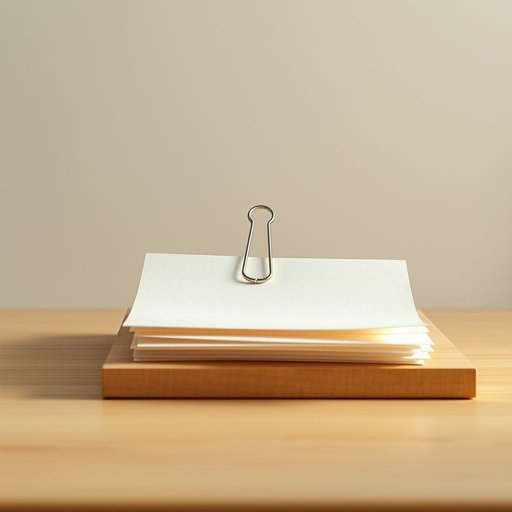

# clip

<h1 style="font-size: 2.5em; font-weight: 300; letter-spacing: 2px; margin: 0; color: #2c3e50;">
/klɪp/
</h1>

---

---

## 例句

The clip on the desk secured the delicate documents, preventing them from scattering across the office floor during the sudden gust of wind from the open window.

*The(/ðə/) clip(/klɪp/) on(/ɔn/) the(/ðə/) desk(/dɛsk/) secured(/sɪˈkjʊrd/) the(/ðə/) delicate(/ˈdɛləkət/) documents,(/ˈdɑkjəmənts,/) preventing(/prɪˈvɛnɪŋ/) them(/ðɛm/) from(/frəm/) scattering(/ˈskætərɪŋ/) across(/əˈkrɔs/) the(/ðə/) office(/ˈɔfəs/) floor(/flɔr/) during(/ˈdʊrɪŋ/) the(/ðə/) sudden(/ˈsədən/) gust(/gəst/) of(/əv/) wind(/wɪnd/) from(/frəm/) the(/ðə/) open(/ˈoʊpən/) window.(/ˈwɪndoʊ./)*

**翻译：** 桌面上的夹子固定住了那些精致的文件，防止它们在窗户突然吹来的阵风中散落满办公室的地板。

---

## 解释

在家居生活用品的语境中，英语单词“clip”作为名词通常指用于固定或夹持物品的小型工具，如文件夹（paper clip）、发夹（hair clip）、衣夹（clothes peg/clip）等，具体使用场合一般涉及整理文件、固定头发、晾晒衣物等日常活动。英语学习者在使用“clip”时需注意其数可数名词性质，通常单数形式指一个夹子，复数形式为“clips”；此外，在搭配上常见表达有“paper clip”（回形针）、“hair clip”（发夹）、“money clip”（钱夹），且“clip”后常接具体名词以明确夹持对象，避免模糊不清。词源方面，“clip”源自古英语“clyppan”，意为“抓住、夹住”，反映该词固有的夹持功能。对于中文语境，“clip”作为家居用品名词，准确翻译应为“夹子”或根据具体用途译为“回形针”、“发夹”、“衣夹”等，需根据实际物品确定翻译，以避免泛泛而谈造成理解偏差。整体来看，“clip”作为名词在家居生活中基本为中性用词，无明显褒贬含义或特殊文化内涵，主要体现其实用功能和便捷性，是日常生活中常见且易于理解的工具名词。

---

<small style="color: #999; font-size: 0.9em;">2025-07-17 06:22:39</small>

