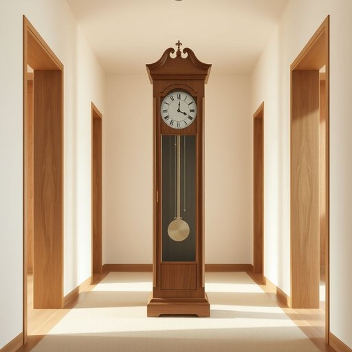

# clock

<h1 style="font-size: 2.5em; font-weight: 300; letter-spacing: 2px; margin: 0; color: #2c3e50;">
/klɑk/
</h1>

---

---

## 例句

The old grandfather clock, which has stood in the hallway for over a century and chimes melodiously every hour, not only serves as a charming decorative piece but also helps us keep track of time during our busiest mornings when everyone is rushing around preparing breakfast and getting ready for the day ahead.

*The(/ðə/) old(/oʊld/) grandfather(/ˈgrænˌfɑðər/) clock,(/klɑk,/) which(/wɪʧ/) has(/həz/) stood(/stʊd/) in(/ɪn/) the(/ðə/) hallway(/ˈhɔlˌweɪ/) for(/fər/) over(/ˈoʊvər/) a(/ə/) century(/ˈsɛnʧəri/) and(/ənd/) chimes(/ʧaɪmz/) melodiously(/melodiously*/) every(/ˈɛvəri/) hour,(/aʊər,/) not(/nɑt/) only(/ˈoʊnli/) serves(/sərvz/) as(/ɛz/) a(/ə/) charming(/ˈʧɑrmɪŋ/) decorative(/ˈdɛkrətɪv/) piece(/pis/) but(/bət/) also(/ˈɔlsoʊ/) helps(/hɛlps/) us(/ˈjuˈɛs/) keep(/kip/) track(/træk/) of(/əv/) time(/taɪm/) during(/ˈdʊrɪŋ/) our(/ɑr/) busiest(/ˈbɪziəst/) mornings(/ˈmɔrnɪŋz/) when(/wɪn/) everyone(/ˈɛvriˌwən/) is(/ɪz/) rushing(/ˈrəʃɪŋ/) around(/əraʊnd/) preparing(/pərˈpɛrɪŋ/) breakfast(/ˈbrɛkfəst/) and(/ənd/) getting(/ˈgɪtɪŋ/) ready(/ˈrɛdi/) for(/fər/) the(/ðə/) day(/deɪ/) ahead.(/əˈhɛd./)*

**翻译：** 那座古老的落地大钟矗立在走廊已有百余年，每小时悠扬地敲响钟声。它不仅是一件别致的装饰品，更在我们最忙碌的早晨发挥着重要作用——当大家匆忙准备早餐、整装待发时，它帮我们掌握时间的节奏。

---

## 解释

英语单词“clock”作为名词在家居生活用品的语境中，通常指用于显示时间的装置，如挂钟、座钟或卧室床头的闹钟等，具体使用场合多见于描述家庭环境中的时间工具，例如“wall clock”（挂钟）、“alarm clock”（闹钟）、“desk clock”（台钟）等，表达时间的精准或装饰功能。学习者在使用“clock”时需注意它通常指的是机械或电子的时钟装置，而非手表（watch）。语法上，“clock”作名词时为可数名词，常见搭配有“set the clock”（调整时钟）、“look at the clock”（看钟表）等，且其复数形式为“clocks”。表达时需区分如“on the clock”意为“正在工作（计时）”的惯用表达，避免混淆。这个词源自中古英语“clokke”，起源于古法语“cloque”，原意为钟声，继而指挂钟或钟表，反映了最早钟表多基于敲钟报时的功能。中文语境中，“clock”准确翻译为“钟”或“钟表”，指代家庭常用的时间显示器，需区别于“表”如手表等，强调其位置和功能，一般无褒贬含义，属于中性词汇。在文化内涵上，时钟作为家庭中的时间象征，既有实用价值，也承载着生活规律和秩序的象征意义。

---

<small style="color: #999; font-size: 0.9em;">2025-07-17 06:22:39</small>

