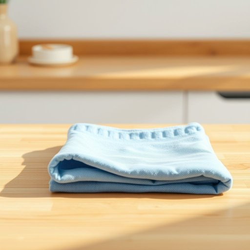

# cloth

<h1 style="font-size: 2.5em; font-weight: 300; letter-spacing: 2px; margin: 0; color: #2c3e50;">
/klɔθ/
</h1>

---

---

## 例句

Could you please hand me the blue cloth that's folded neatly on the kitchen counter, the one we usually use for wiping down the wooden surfaces and polishing the glassware after dinner?

*Could(/kʊd/) you(/ju/) please(/pliz/) hand(/hænd/) me(/mi/) the(/ðə/) blue(/blu/) cloth(/klɔθ/) that's(/ðæts/) folded(/ˈfoʊldɪd/) neatly(/ˈnitli/) on(/ɔn/) the(/ðə/) kitchen(/ˈkɪʧən/) counter,(/ˈkaʊntər,/) the(/ðə/) one(/wən/) we(/wi/) usually(/ˈjuʒəwəli/) use(/juz/) for(/fər/) wiping(/ˈwaɪpɪŋ/) down(/daʊn/) the(/ðə/) wooden(/ˈwʊdən/) surfaces(/ˈsərfəsɪz/) and(/ənd/) polishing(/ˈpɑlɪʃɪŋ/) the(/ðə/) glassware(/ˈglæsˌwɛr/) after(/ˈæftər/) dinner?(/ˈdɪnər?/)*

**翻译：** 请你把厨房台面上整齐叠放的那块蓝色布递给我，就是我们平时用来擦拭木质表面和晚餐后擦亮玻璃器皿的那块。

---

## 解释

英语单词cloth作为名词在家居生活用品的语境中通常指用纺织材料制成的布料或布片，具体使用场合包括擦拭家具、清洁表面、制作桌布、窗帘、靠垫套等家用纺织品时。学习者应注意cloth是不可数名词，表示材料或整体布料时通常不加复数形式，但当指不同种类或一块块布时，也可用复数cloths。常见搭配有cleaning cloth（清洁布）、table cloth（桌布）、cloth napkin（布餐巾）等。语法上，cloth不能与cloths混淆，因为cloths更多用于指多块不同用途或类型的布块。这个词源自中古英语，通过古法语clot，最终追溯至拉丁语claudere，意为包裹或覆盖，这反映了其作为覆盖物的属性。在中文语境中，cloth准确翻译为布或布料，强调其材质和用途，与具体的衣物clothes不同，后者译为衣服，二者不可混淆。该词本身无明显褒贬或特殊文化色彩，属于日常生活中常用而中性的一般名词，理解时侧重其物质属性和使用功能即可。

---

<small style="color: #999; font-size: 0.9em;">2025-07-17 06:22:39</small>

