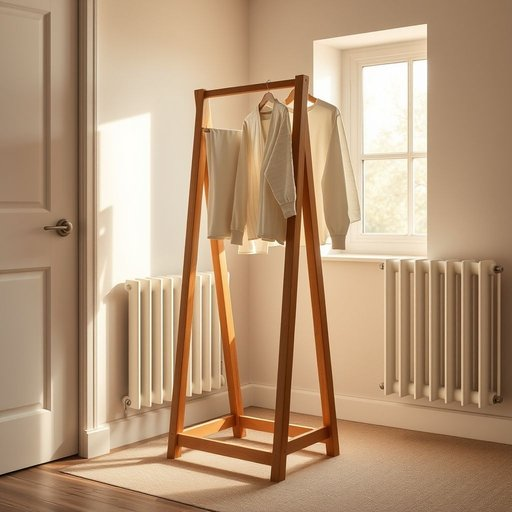

# clotheshorse

<h1 style="font-size: 2.5em; font-weight: 300; letter-spacing: 2px; margin: 0; color: #2c3e50;">
/ˈkloʊzˌhɔrs/
</h1>

---

---

## 例句

Despite the limited space in our flat, I have managed to squeeze in a sturdy wooden clotheshorse near the radiator, where damp clothes can dry efficiently without cluttering the living room or obstructing the natural light from the window.

*Despite(/dɪˈspaɪt/) the(/ðə/) limited(/ˈlɪmɪtɪd/) space(/speɪs/) in(/ɪn/) our(/ɑr/) flat,(/flæt,/) I(/aɪ/) have(/hæv/) managed(/ˈmænɪʤd/) to(/tɪ/) squeeze(/skwiz/) in(/ɪn/) a(/ə/) sturdy(/ˈstərdi/) wooden(/ˈwʊdən/) clotheshorse(/ˈkloʊzˌhɔrs/) near(/nɪr/) the(/ðə/) radiator,(/ˈreɪdiˌeɪtər,/) where(/wɛr/) damp(/dæmp/) clothes(/kloʊðz/) can(/kən/) dry(/draɪ/) efficiently(/ɪˈfɪʃəntli/) without(/wɪˈθaʊt/) cluttering(/ˈklətərɪŋ/) the(/ðə/) living(/ˈlɪvɪŋ/) room(/rum/) or(/ər/) obstructing(/əbˈstrəktɪŋ/) the(/ðə/) natural(/ˈnæʧərəl/) light(/laɪt/) from(/frəm/) the(/ðə/) window.(/ˈwɪndoʊ./)*

**翻译：** 尽管我的公寓空间有限，我还是设法在暖气片附近放置了一个结实的木质晾衣架，湿衣物可以高效地晾干，既不凌乱客厅，也不妨碍窗户的自然采光。

---

## 解释

英语单词“clotheshorse”作为家居生活用品中的名词，主要指用来晾晒衣物的架子或支架，通常是金属或木制，设计成可以挂晒或撑开衣服，使其自然风干，常见于家庭阳台、浴室或庭院等场合。使用时，这个词多出现在描述晾衣的环境和工具中，比如“I put the wet clothes on the clotheshorse to dry”（我把湿衣服挂在晾衣架上晾干）。语法上，“clotheshorse”作为可数名词，需根据语境加单复数形式（clotheshorse/clotheshorses），前面可加冠词或数量词，如a clotheshorse、two clotheshorses。在表达时，注意它是复合词，由clothes（衣服）和horse（马）组成，整体比喻为支撑衣服晾晒的“架子”。词源方面，“clotheshorse”最早起源于18世纪，horse在这里是指一种支架或架子，类似骑马时的“马”，象征支撑物。该词并无明显褒贬色彩，纯粹指代晾衣用具，没有隐含感情色彩或特殊文化内涵。中文中，“clotheshorse”准确翻译为“晾衣架”或“晾衣马”，强调其家居生活用品的实用功能，理解时应避免与指代爱穿衣打扮的人（fashionista或dandy）混淆；后者在英语中有时也被俗称为clotheshorse，但家居语境中主要指晾衣用的架子。综上，clotheshorse在家居生活领域是日常实用品名词，使用时需结合具体语境，注意语法单复数形式及搭配，理解其起源帮助区分不同语义，中文对应为“晾衣架”，主要功能是晾晒衣物，无特殊褒义或贬义。

---

<small style="color: #999; font-size: 0.9em;">2025-07-17 06:22:39</small>

