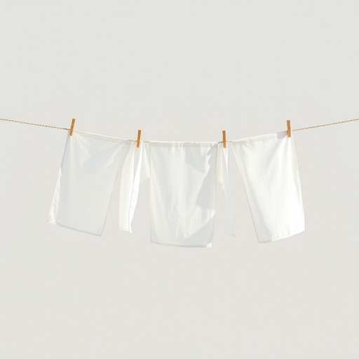

# clothesline

<h1 style="font-size: 2.5em; font-weight: 300; letter-spacing: 2px; margin: 0; color: #2c3e50;">
/clothesline*/
</h1>

---

---

## 例句

Although the meeting was supposed to start at nine, the discussion about the project's budget took so long that the agenda was completely overshadowed by the financial considerations, making the budget the most critical factor in deciding the next steps.

*Although(/ˌɔlˈðoʊ/) the(/ðə/) meeting(/ˈmitɪŋ/) was(/wɑz/) supposed(/səˈpoʊzd/) to(/tɪ/) start(/stɑrt/) at(/æt/) nine,(/naɪn,/) the(/ðə/) discussion(/dɪˈskəʃən/) about(/əˈbaʊt/) the(/ðə/) project's(/ˈprɑʤɛkts/) budget(/ˈbəʤɪt/) took(/tʊk/) so(/soʊ/) long(/lɔŋ/) that(/ðət/) the(/ðə/) agenda(/əˈʤɛndə/) was(/wɑz/) completely(/kəmˈplitli/) overshadowed(/ˌoʊvərˈʃædoʊd/) by(/baɪ/) the(/ðə/) financial(/ˌfaɪˈnænʃəl/) considerations,(/kənˌsɪdərˈeɪʃənz,/) making(/ˈmeɪkɪŋ/) the(/ðə/) budget(/ˈbəʤɪt/) the(/ðə/) most(/moʊst/) critical(/ˈkrɪtɪkəl/) factor(/ˈfæktər/) in(/ɪn/) deciding(/ˌdɪˈsaɪdɪŋ/) the(/ðə/) next(/nɛkst/) steps.(/stɛps./)*

**翻译：** 尽管会议原定于九点开始，但关于项目预算的讨论持续了很久，以至于议程完全被财务问题所掩盖，使得预算成为决定下一步行动的最关键因素。

---

## 解释

clothesline作为名词在家居生活用品的语境中指的是用于晾晒衣物的绳索通常固定在室外的两点之间用于挂晾湿衣服以便干燥具体使用场合多见于家庭后院阳台或庭院尤其在不使用烘干机或自然晾晒衣物时非常常见英语学习者使用该词时需注意其单数形式为clothesline复数形式为clotheslines并且该词通常作为可数名词出现常见搭配包括hang clothes on the clothesline把衣服挂在晾衣绳上dry clothes on a clothesline在晾衣绳上晾干衣服等表达时也可以用作短语put the clothes out on the clothesline表示晾衣词源上clothesline由clothes衣服和line绳索合成最早可追溯到19世纪反映了其作为衣服挂晾工具的直接功能属性在中文语境中clothesline准确翻译为晾衣绳或晒衣绳它是一个中性且常见的名词没有褒贬含义或特殊文化色彩仅反映一种传统且实用的晾晒工具总的来说该词在日常生活描述晾衣行为时使用频繁英语学习者掌握其用法有助于表达与家庭生活节能环保相关的日常场景

---

<small style="color: #999; font-size: 0.9em;">2025-07-17 06:22:39</small>

