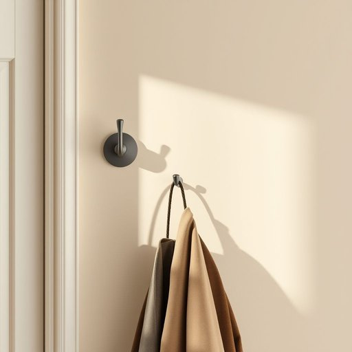

# coat-hook

<h1 style="font-size: 2.5em; font-weight: 300; letter-spacing: 2px; margin: 0; color: #2c3e50;">
/coat-hook*/
</h1>

---

---

## 例句

Before guests arrived, she meticulously checked that every coat-hook in the hallway, including the one by the front door which had a slightly loose screw, was sturdy enough to hold heavy winter jackets without wobbling or falling off the wall.

*Before(/ˌbiˈfɔr/) guests(/gɛsts/) arrived,(/əraɪvd,/) she(/ʃi/) meticulously(/məˈtɪkjələsli/) checked(/ʧɛkt/) that(/ðət/) every(/ˈɛvəri/) coat-hook(/coat-hook*/) in(/ɪn/) the(/ðə/) hallway,(/ˈhɔlˌweɪ,/) including(/ˌɪnˈkludɪŋ/) the(/ðə/) one(/wən/) by(/baɪ/) the(/ðə/) front(/frənt/) door(/dɔr/) which(/wɪʧ/) had(/hæd/) a(/ə/) slightly(/sˈlaɪtli/) loose(/lus/) screw,(/skru,/) was(/wɑz/) sturdy(/ˈstərdi/) enough(/ɪˈnəf/) to(/tɪ/) hold(/hoʊld/) heavy(/ˈhɛvi/) winter(/ˈwɪntər/) jackets(/ˈʤækɪts/) without(/wɪˈθaʊt/) wobbling(/ˈwɑbəlɪŋ/) or(/ər/) falling(/ˈfɑlɪŋ/) off(/ɔf/) the(/ðə/) wall.(/wɔl./)*

**翻译：** 在客人到来之前，她细心检查了走廊里每一个衣帽钩，包括门口那个螺丝稍微有些松动的，确保它们都足够坚固，能稳稳地挂住厚重的冬季大衣，不会晃动或从墙上掉落。

---

## 解释

英语单词"coat-hook"作为名词，主要指安装在墙壁或门后，用来悬挂外套、衣物、帽子等的钩子，常见于家庭、办公室或公共场所的入口处，便于整理和存放衣物。在具体使用场合和语境中，"coat-hook"多用于描述居家生活中的收纳工具，常见表达如"hang your coat on the coat-hook"（把外套挂在衣钩上），体现其实用性。学习者使用时需注意它是一个复合名词，通常以连字符连接，作单数或复数形式（coat-hooks），且该词多用作可数名词，前面可加冠词或数量词。此外，"coat-hook"在搭配中常与动词"hang"或"put"连用，并可作定语修饰后面的名词，如"coat-hook rack"（衣钩架）。从词源上看，"coat"意为外套，"hook"意为钩子，二者合成表意直观，构成复合词结构，体现功能属性。中文语境中，"coat-hook"应准确译为“衣钩”或“衣帽钩”，强调其挂衣物的用途，避免误译为其他钩状物。该词在语义上中性，没有褒贬含义或特殊文化色彩，是日常生活中常见且实用的居家用品名称。

---

<small style="color: #999; font-size: 0.9em;">2025-07-17 06:22:39</small>

