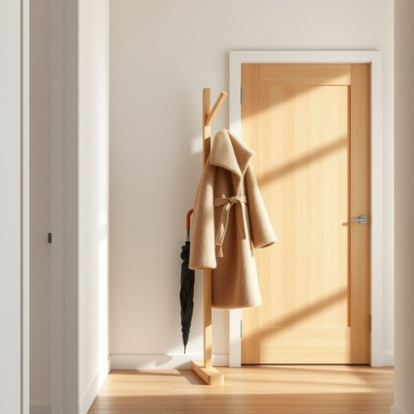

# coat-stand

<h1 style="font-size: 2.5em; font-weight: 300; letter-spacing: 2px; margin: 0; color: #2c3e50;">
/coat-stand*/
</h1>

---

---

## 例句

Every evening, before settling down with a book in the living room, she carefully hung her damp umbrella and bulky winter coat on the intricately carved coat-stand by the front door, which not only helped keep the hallway tidy but also added a touch of vintage charm to the otherwise modern décor.

*Every(/ˈɛvəri/) evening,(/ˈivnɪŋ,/) before(/ˌbiˈfɔr/) settling(/ˈsɛtəlɪŋ/) down(/daʊn/) with(/wɪθ/) a(/ə/) book(/bʊk/) in(/ɪn/) the(/ðə/) living(/ˈlɪvɪŋ/) room,(/rum,/) she(/ʃi/) carefully(/ˈkɛrfəli/) hung(/həŋ/) her(/hər/) damp(/dæmp/) umbrella(/ˈəmˌbrɛlə/) and(/ənd/) bulky(/ˈbəlki/) winter(/ˈwɪntər/) coat(/koʊt/) on(/ɔn/) the(/ðə/) intricately(/ˈɪntrəkətli/) carved(/kɑrvd/) coat-stand(/coat-stand*/) by(/baɪ/) the(/ðə/) front(/frənt/) door,(/dɔr,/) which(/wɪʧ/) not(/nɑt/) only(/ˈoʊnli/) helped(/hɛlpt/) keep(/kip/) the(/ðə/) hallway(/ˈhɔlˌweɪ/) tidy(/ˈtaɪdi/) but(/bət/) also(/ˈɔlsoʊ/) added(/ˈædɪd/) a(/ə/) touch(/təʧ/) of(/əv/) vintage(/ˈvɪntɪʤ/) charm(/ʧɑrm/) to(/tɪ/) the(/ðə/) otherwise(/ˈəðərˌwaɪz/) modern(/ˈmɑdərn/) décor.(/décor*./)*

**翻译：** 每晚，在客厅静坐翻阅书籍之前，她都会小心地将潮湿的伞和臃肿的冬袄挂在玄关处那座雕工精美的衣帽架上，这不仅有助于保持走廊的整洁，也为原本现代的装饰增添了一抹复古的韵味。

---

## 解释

英语单词“coat-stand”作为名词，指的是一种家居生活用品，通常放置于门厅或入口处，用来悬挂外套、帽子、围巾等物品的立式衣架。具体使用场合多见于家庭、办公室或公共场所的入口区域，以便来访者或居住者方便地存放外衣，保持室内整洁。在语法上，“coat-stand”是一个可数名词，复数形式为“coat-stands”，学习者在使用时需注意与冠词搭配，如“a coat-stand”表示一件衣帽架，常见的搭配有“wooden coat-stand”（木制衣帽架）、“metal coat-stand”（金属衣帽架）等，此外也会用在表示放置或使用场景的表达中，如“hang your coat on the coat-stand”。词源方面，“coat-stand”由“coat”（外套）与“stand”（架子、支架）组合而成，体现了其功能性命名特点，起源于19世纪工业革命后家庭生活用品的细分，强调悬挂和摆放外套的实用物品。中文语境中，“coat-stand”常被准确翻译为“衣帽架”或“衣帽立架”，强调其立式结构和用于挂置衣物的功能，且无褒贬含义，属于中性词汇，在家庭装修和家居布局讨论时经常出现。其文化内涵较为普通，主要体现的是西式生活习惯中注重入口空间整洁和物品分类存放的理念，没有特殊的感情色彩或隐喻。

---

<small style="color: #999; font-size: 0.9em;">2025-07-17 06:22:39</small>

